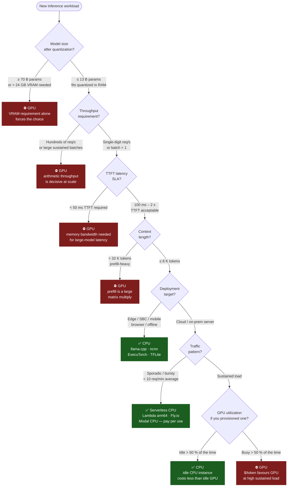

# Awesome CPU-First AI [](https://awesome.re)

> Training needs GPUs. Inference usually doesn't. Start with CPU; justify the GPU.

A curated list of runtimes, formats, tools, and evidence for running AI inference on CPU — the platform you already have everywhere.

---

## Introduction

Most AI practitioners default to GPU for everything because that is where training lives. But once a model is trained, the inference workload often fits comfortably on a modern CPU: smaller batch sizes, modest throughput requirements, and quantized models that slip inside L3 cache. Independent analysis of the Hugging Face ecosystem finds 40–51% of models are sub-7B and 55–65% are sub-13B parameters — 92% of all downloads go to models under 1B params and the median downloaded model is just 406M params. The vast majority of inference workloads people actually run never needed a GPU. This list is for engineers who want to question that GPU default and reach for the right tool instead of the expensive one. It is aimed at practitioners deploying inference on servers, laptops, edge devices, or serverless functions — anywhere a GPU is absent, costly, or simply overkill. The list is GPU-skeptical, not GPU-hostile; the [When you actually do want a GPU](#when-you-actually-do-want-a-gpu) section is load-bearing, not decorative.

---

## Quick Start

Three paths from zero to CPU inference — no GPU, no CUDA, no container.

**1 — Desktop (llamafile — zero install)**

A self-contained executable that runs on Linux, macOS, and Windows with no dependencies.

```bash
curl -LO https://huggingface.co/mozilla-ai/llamafile_0.10/resolve/main/Qwen3.5-0.8B-Q8_0.llamafile
chmod +x Qwen3.5-0.8B-Q8_0.llamafile
./Qwen3.5-0.8B-Q8_0.llamafile        # opens chat UI at http://localhost:8080
```

**2 — Server / CLI (ollama)**

Manages model downloads and exposes an OpenAI-compatible API endpoint.

```bash
curl -fsSL https://ollama.com/install.sh | sh   # Linux / macOS
ollama run llama3.2:3b                           # pulls Llama-3.2 3B Q4 (~2 GB) and opens CLI chat
```

**3 — Browser (WebLLM — WASM / CPU fallback)**

Runs the model in a browser tab — no server, no API key.

```bash
npm install @mlc-ai/web-llm
```

```javascript
import { CreateMLCEngine } from "@mlc-ai/web-llm";
const engine = await CreateMLCEngine("Llama-3.2-1B-Instruct-q4f32_1-MLC");
const { choices } = await engine.chat.completions.create({
  messages: [{ role: "user", content: "Hello" }],
});
console.log(choices[0].message.content);
```

*(WebLLM uses WebGPU when available and falls back to WebAssembly on CPU-only browsers.)*

---

## When to Opt for CPU vs GPU

| Dimension | Lean CPU | Lean GPU |
|---|---|---|
| **Workload type** | Inference | Training, fine-tuning |
| **Model size** | ≤ 13B params (quantized) — covers ~60% of Hugging Face models | 70B+ params, dense/unquantized — covers < 8% of models |
| **Throughput need** | Low-to-medium (single-digit req/s) | High (hundreds of req/s, batched) |
| **Batch size** | Batch = 1 or small ad-hoc bursts | Large, sustained batched serving |
| **Latency SLA** | Relaxed (100 ms–2 s TTFT tolerable) | Tight (< 50 ms TTFT on large models) |
| **Context length** | Short-to-medium (≤ 8 K tokens) | Very long (32 K+ tokens, prefill-heavy) |
| **Deployment target** | Edge, on-device, serverless, SBC | Dedicated inference cluster |
| **Cost / availability** | CPU instances are ubiquitous; no VRAM cap | GPU instances cost 5–20× more; VRAM is a hard ceiling |
| **Modality** | Text, embeddings, small audio | Real-time diffusion, video generation, large vision models |

---

## Decision Flowchart



---

## Contents

- [Quick Start](#quick-start)
- [When to Opt for CPU vs GPU](#when-to-opt-for-cpu-vs-gpu)
- [Decision Flowchart](#decision-flowchart)
- [Runtimes and Inference Engines](#runtimes-and-inference-engines)
- [Quantization and Model Formats](#quantization-and-model-formats)
- [Performance Tuning](#performance-tuning)
- [Mixture-of-Experts on CPU](#mixture-of-experts-on-cpu)
- [Benchmarks and Evidence](#benchmarks-and-evidence)
- [On-Device, Edge, ARM, and SBCs](#on-device-edge-arm-and-sbcs)
- [Vision on CPU](#vision-on-cpu)
- [Multimodal CPU Workloads](#multimodal-cpu-workloads)
- [Cloud ARM Servers](#cloud-arm-servers)
- [Cost and Deployment Economics](#cost-and-deployment-economics)
- [When You Actually Do Want a GPU](#when-you-actually-do-want-a-gpu)
- [Talks, Papers, and Articles](#talks-papers-and-articles)
- [CPU Inference Deployment Guide](docs/cpu-inference-deployment.md)
- [Cost Calculator](docs/cost-calculator.md)
- [Green Inference Guide](docs/green-inference.md)
- [Model Conversion Guide](docs/model-conversion-guide.md)
- [Serverless CPU Patterns](docs/serverless-patterns.md)
- [Benchmark Methodology](docs/benchmark-methodology.md)
- [Troubleshooting](docs/troubleshooting.md)

---

## Runtimes and Inference Engines

- [candle](https://github.com/huggingface/candle) — Hugging Face's Rust ML framework; CPU execution is the primary target, with optional CUDA support compiled in separately.
- [ctransformers](https://github.com/marella/ctransformers) — Python bindings for GGML/GGUF models; lets Python callers run quantized models on CPU without touching C++.
- [ggml](https://github.com/ggerganov/ggml) — The tensor library underlying llama.cpp; hand-optimized CPU kernels using SIMD intrinsics for AVX2, AVX-512, NEON, and SVE.
- [Intel Extension for Transformers](https://github.com/intel/intel-extension-for-transformers) — Drop-in optimization layer for Hugging Face Transformers that applies CPU-specific INT4/INT8 kernels, AMX acceleration, and weight-only quantization.
- [llamafile](https://github.com/mozilla-ai/llamafile) — Distributable single-file LLM executables (built on llama.cpp + Cosmopolitan libc) that run on CPU across Linux, macOS, and Windows with no install.
- [llama.cpp](https://github.com/ggerganov/llama.cpp) — C/C++ LLM inference engine designed from day one for CPU; optional GPU offload of individual layers rather than GPU-first design.
- [llama2.c](https://github.com/karpathy/llama2.c) — Andrej Karpathy's minimal C implementation of LLaMA 2 inference; a pedagogical reference showing that CPU inference requires no ML framework, only a few hundred lines of C.
- [MNN](https://github.com/alibaba/MNN) — Alibaba's inference engine for mobile and edge; CPU is the primary target, with quantization-aware kernels for ARM NEON and x86 SSE/AVX.
- [ncnn](https://github.com/Tencent/ncnn) — Mobile and embedded neural network inference framework optimized for ARM and x86 CPUs; no dependencies, builds for Raspberry Pi, Jetson (CPU-only mode), and RISC-V with no OS-level GPU driver requirement.
- [ONNX Runtime (CPU EP)](https://onnxruntime.ai/docs/execution-providers/CPU-ExecutionProvider.html) — The CPU Execution Provider in ONNX Runtime; production-grade, supports operator fusion and quantized INT8 models natively on x86 and ARM.
- [ollama](https://github.com/ollama/ollama) — Local model runner that falls back to full CPU execution when no GPU is present; convenient for development and low-traffic deployments. *(Note: GPU is used when available; included here for its CPU fallback path and single-binary packaging story.)*
- [OpenVINO](https://github.com/openvinotoolkit/openvino) — Intel's model optimization and inference toolkit; targets x86 CPU as first-class hardware with graph optimization passes specific to Intel µarchs.
- [rwkv.cpp](https://github.com/RWKV/rwkv.cpp) — CPU inference library for RWKV v4–v7 language models (INT4/INT5/INT8 and FP16); RWKV's recurrent state requires O(1) memory per token at inference time with no growing KV cache, making it especially suited to CPU inference under long context lengths where transformer KV-cache memory becomes prohibitive.
- [Transformers.js](https://github.com/huggingface/transformers.js) — Hugging Face's in-browser transformer inference library; runs ONNX models via WebAssembly (CPU) or WebGPU, supporting 200+ architectures across NLP, vision, and audio with zero server dependency. CPU execution uses ONNX Runtime Web's WASM backend with INT8 quantization.
- [WebLLM](https://github.com/mlc-ai/web-llm) — In-browser LLM inference engine built on MLC LLM and Apache TVM; uses WebGPU when available and falls back to WebAssembly for CPU-only execution, delivering an OpenAI-compatible API callable from browser JavaScript with no server required.
- [whisper.cpp](https://github.com/ggerganov/whisper.cpp) — Port of OpenAI Whisper to ggml; runs speech-to-text inference entirely on CPU with explicit ARM NEON and AVX paths; on Raspberry Pi 5, the base model achieves 3–5× real-time throughput and the JFK benchmark completes in approximately 9 s with the float32 tiny model.

**Runtime comparison at a glance**

| Runtime | Native Format | CPU Arch | OS |
|---|---|---|---|
| llama.cpp | GGUF | x86, ARM, RISC-V | Linux, macOS, Windows |
| ONNX Runtime | ONNX | x86, ARM, WASM | Linux, macOS, Windows |
| OpenVINO | OpenVINO IR | x86 | Linux, Windows |
| ncnn | ncnn | x86, ARM, RISC-V | Linux, Windows, Android |
| MNN | MNN | x86, ARM | Linux, Windows, Android, iOS |
| candle | GGUF, safetensors | x86, ARM | Linux, macOS, Windows |
| Transformers.js | ONNX | WASM | Browser |
| WebLLM | MLC | WASM, WebGPU | Browser |
| ExecuTorch | ExecuTorch | x86, ARM | Linux, Android, iOS |
| TensorFlow Lite | TFLite | x86, ARM | Linux, Windows, Android, iOS |
| Intel Ext. for Transformers | PyTorch, ONNX | x86 | Linux, Windows |
| whisper.cpp | GGUF | x86, ARM | Linux, macOS, Windows |

---

## Quantization and Model Formats

- [GGUF](https://github.com/ggerganov/ggml/blob/master/docs/gguf.md) — The successor to GGML format; single-file container for quantized weights plus model metadata, designed for memory-mapped loading that avoids RAM copies on CPU.
- [Intel Neural Compressor](https://github.com/intel/neural-compressor) — Framework-agnostic post-training quantization and pruning toolkit targeting CPU inference; supports ONNX, PyTorch, and TensorFlow backends.
- [Optimum](https://github.com/huggingface/optimum) — Hugging Face's optimization toolkit; the `optimum[onnxruntime]` and `optimum-intel` paths export and quantize models for CPU inference via ONNX Runtime and OpenVINO respectively.
- [AutoGPTQ](https://github.com/AutoGPTQ/AutoGPTQ) — GPTQ quantization library. *(Caveat: primarily targets GPU inference; include only when the produced GPTQ checkpoints are subsequently converted to GGUF for CPU use. Do not assume CPU parity.)*
- [llama.cpp quantize tool](https://github.com/ggml-org/llama.cpp/blob/master/tools/quantize/README.md) — Built-in `llama-quantize` binary converting Hugging Face checkpoints to GGUF; covers k-quants (Q4_K_M, Q5_K_M, Q6_K) and importance-matrix–guided i-quants (IQ3_XS, IQ4_XS) that route more bits to high-impact weights — IQ4_XS saves ~400 MB vs Q4_K_M on a 7B model at comparable accuracy. Pair with `--imatrix` for any format below Q5_K_M.
- [llama.cpp imatrix tool](https://github.com/ggml-org/llama.cpp/blob/master/tools/imatrix/README.md) — Calibration pass that runs a small corpus through the unquantized model and records per-layer weight importance; the resulting `.imatrix` file is passed to `llama-quantize` and significantly improves output quality at aggressive compression ratios (IQ3_XS, IQ4_XS, Q3_K_S).

---

## Performance Tuning

- [llama.cpp token generation performance tips](https://github.com/ggml-org/llama.cpp/blob/master/docs/development/token_generation_performance_tips.md) — Official guidance on setting `--threads`, `--threads-batch`, CPU affinity masks, and NUMA-aware memory allocation for multi-socket servers.
- [OpenBLAS](https://github.com/OpenMathLib/OpenBLAS) — Optimized BLAS implementation with auto-tuned kernels for x86 (SSE/AVX/AVX-512) and ARM; a drop-in dependency for frameworks that delegate GEMM to BLAS.
- [Intel MKL / oneMKL](https://www.intel.com/content/www/us/en/developer/tools/oneapi/onemkl.html) — Intel's math kernel library with AVX-512 and AMX-optimized GEMM; free to use and typically the fastest BLAS on recent Xeon hardware.
- [Intel AMX (Advanced Matrix Extensions)](https://www.intel.com/content/www/us/en/products/docs/accelerator-engines/what-is-intel-amx.html) — Hardware matrix multiplication tiles in Sapphire Rapids and later Xeon CPUs; AMX delivers 2,048 INT8 operations per cycle vs 256 for AVX-512 VNNI — an 8× arithmetic throughput improvement for quantized inference on the same silicon; llama.cpp and ONNX Runtime both expose AMX code paths. [(Intel AMX solution brief)](https://www.intel.com/content/dam/www/central-libraries/us/en/documents/2022-12/accelerate-ai-with-amx-sb.pdf)
- [numactl](https://github.com/numactl/numactl) — Linux utility to bind a process to specific NUMA nodes and CPU cores; essential for avoiding cross-socket memory latency on multi-socket inference servers.
- [perf + Linux PMU](https://perfwiki.github.io/main/) — Standard Linux profiling tool; useful for measuring LLC miss rates and memory bandwidth saturation during inference, which are the dominant bottlenecks on CPU.
- [likwid](https://github.com/RRZE-HPC/likwid) — Hardware performance counter tool suite for x86; provides memory bandwidth and FLOP/s measurements useful for diagnosing inference throughput limits on specific µarchs.

---

## Mixture-of-Experts on CPU

Mixture-of-Experts (MoE) architectures are often assumed to require GPU because of their large total parameter counts, but the sparse routing mechanism — activating only a subset of experts per token — creates a different compute profile that can benefit CPU deployment. The activated parameters are typically 5–10% of total (e.g., 37B activated out of 671B total in DeepSeek-R1), so aggressive quantization brings the working set within reach of CPU instances with sufficient RAM.

- [DeepSeek-R1: Incentivizing Reasoning Capability in LLMs via Reinforcement Learning (DeepSeek, Jan 2025)](https://arxiv.org/abs/2501.12948) — Introduces DeepSeek-R1 (671B total, 37B activated per token) and distilled dense variants from 1.5B to 70B; the dense distillations run on any CPU with llama.cpp at Q4, and the full MoE model with IQ1_S quantization fits within ~10 GB RAM on CPU.
- [Deploy DeepSeek-R1 on Arm Servers with llama.cpp (Arm Learning Paths, Apr 2026)](https://learn.arm.com/learning-paths/servers-and-cloud-computing/deepseek-cpu/) — Walkthrough for DeepSeek-R1-Distill-Qwen-7B Q4_K_M on AWS Graviton4; benchmarks 18–22 tok/s generation and ~420 tok/s prompt processing on 24 vCPU, 192 GB RAM with ~5.8 GB model RAM use.
- [DeepSeek-R1 7B on OCI Ampere A1: Full CPU Inference Guide (asknikhil.com, May 2026)](https://www.asknikhil.com/post/deepseek-r1-7b-on-oci-ampere-a1-full-cpu-inference-guide-no-gpu-required) — Practitioner guide deploying DeepSeek-R1-Distill-Qwen-7B Q4_K_M on OCI Ampere A1 free-tier ARM instances; reports ~18–22 tok/s generation, ~420 tok/s prompt processing, and ~5.8 GB RAM utilisation with no CUDA/driver setup required.

---

## Benchmarks and Evidence

- [llama.cpp performance tracking](https://github.com/ggerganov/llama.cpp/issues/4167) — Community-maintained thread with tokens/second figures for various models across CPU and GPU hardware; useful as a real-world comparison baseline.
- [LLM Inference Benchmarking Cheat-Sheet (llm-tracker.info)](https://llm-tracker.info/howto/LLM-Inference-Benchmarking-Cheat%E2%80%91Sheet-for-Hardware-Reviewers) — Canonical reference explaining llama.cpp benchmark metrics (pp512/tg128), quantization naming conventions, and how to correctly interpret and compare community-reported figures across hardware platforms.
- [MyAIHardware — llama.cpp benchmarks](https://www.myaihardware.com/llama-cpp-benchmarks) — Aggregated llama.cpp benchmark scoreboard across CPUs, GPUs, and NPUs under standardized test conditions; useful for hardware selection and cross-platform throughput comparison.
- [MLPerf Inference — edge CPU submissions](https://mlcommons.org/benchmarks/inference-edge/) — Industry-audited inference benchmark with CPU-only submissions in the edge category; provides verified latency/throughput figures under defined, reproducible test conditions.
- [MLPerf Inference v5.0 — datacenter CPU submissions (MLCommons, Apr 2025)](https://mlcommons.org/2025/04/mlperf-inference-v5-0-results/) — Industry-audited inference benchmark with CPU-only datacenter submissions on Intel Xeon 6 Granite Rapids; reports GPT-J at 316 tok/s (INT4), Llama-3.1-8B at 450 tok/s (server) and 1,196 tok/s (offline). Intel remains the only vendor submitting server CPU results. ([Dell 2S-GNR results](https://github.com/mlcommons/inference_results_v5.0/tree/main/closed/Dell/results/1-node-2S-GNR_86C), [Supermicro results](https://github.com/mlcommons/inference_results_v5.0/tree/main/closed/Supermicro/results/1-node-2S-GNR_128C))
- [ONNX Runtime GenAI CPU benchmark (ISE Developer Blog, May 2025)](https://devblogs.microsoft.com/ise/running-rag-onnxruntime-genai/) — Production benchmark comparing ONNX Runtime GenAI, llama.cpp, and Hugging Face Optimum for Phi-3 on CPU; ONNX Runtime achieved 137.6 tok/s vs 109.5 for llama.cpp and 108.3 for Optimum — 1.2–1.6× higher throughput across prompt lengths with equivalent latency.
- [OpenVINO Model Hub benchmarks (Intel, 2025)](https://www.intel.com/content/www/us/en/developer/tools/openvino-toolkit/model-hub.html) — Intel's centralized benchmark catalog for LLMs on Xeon CPUs with INT4/INT8/FP16 precision; reports DeepSeek-R1-Distill-Llama-8B at 155.4 tok/s and Llama-3-8B at 376 tok/s (OpenVINO Model Server) on Intel Xeon Platinum. ([OpenVINO LLM benchmark tool](https://github.com/openvinotoolkit/openvino.genai/tree/master/tools/llm_bench), [white paper](https://www.intel.com/content/dam/develop/public/us/en/documents/llm-with-model-server-white-paper.pdf))
- [Simon Willison's llama.cpp experiments](https://simonwillison.net/tags/llama-cpp/) — Practitioner write-ups with real-world timing data across diverse CPU hardware; useful for calibrating expectations before purchasing cloud instances.
- [Model size distribution on Hugging Face](https://huggingface.co/blog/huggingface/state-of-os-hf-spring-2026) — Independent analyses of the Hugging Face ecosystem find 40–51% of models are sub-7B and 55–65% are sub-13B parameters, with 92% of all downloads going to models under 1B params and the median downloaded model at 406M params. ([MoClaw, Apr 2026](https://moclaw.ai/blog/huggingface-hub-state-2026), [HF model stats, Oct 2025](https://huggingface.co/blog/lbourdois/huggingface-models-stats))

---

## On-Device, Edge, ARM, and SBCs

- [Core ML](https://developer.apple.com/machine-learning/core-ml/) — Apple's on-device inference framework for iOS, macOS, and visionOS; runs models on the CPU (ANE/GPU also supported but optional) with optimized kernels for Apple Silicon M-series chips. Supports model conversion from PyTorch and TensorFlow via [`coremltools`](https://github.com/apple/coremltools).
- [ExecuTorch](https://github.com/pytorch/executorch) — PyTorch's on-device inference runtime; designed for mobile and embedded, with CPU kernels for ARM (XNNPACK backend) as the primary deployment target.
- [XNNPACK](https://github.com/google/XNNPACK) — Google's accelerated neural network inference library for ARM and x86; used as the CPU backend in TFLite, ExecuTorch, and ONNX Runtime's mobile path.
- [TensorFlow Lite](https://www.tensorflow.org/lite) — Google's inference runtime for mobile and embedded; the default execution path is CPU (ARM/x86), with delegate APIs for optional hardware accelerators.
- [MLC LLM (WebAssembly/CPU target)](https://github.com/mlc-ai/mlc-llm) — Compiles LLMs to native CPU code or WebAssembly via TVM; the browser/WASM target is inherently CPU-only. *(Note: also targets GPU; relevant here specifically for its WebAssembly/CPU compilation path.)*
- [llama.cpp Android build](https://github.com/ggerganov/llama.cpp/blob/master/docs/android.md) — Official docs for cross-compiling llama.cpp for Android ARM; runs on-device without network access or cloud inference costs.
- [V-Seek — LLM inference on RISC-V server CPUs (arxiv:2503.17422)](https://arxiv.org/abs/2503.17422) — Paper documenting LLM inference optimizations on the Sophon SG2042, the first commercially available many-core RISC-V server CPU (64 RVV-capable cores); achieves 13 tok/s for 7B models and 5.5× throughput over baseline llama.cpp by exploiting RISC-V Vector (RVV) extensions with vectorized GEMM kernels.
- [Intel Core Ultra with OpenVINO (Intel, 2024)](https://www.intel.com/content/www/us/en/developer/articles/technical/chatbot-on-your-laptop-phi-2-core-ultra-processors.html) — Demonstrates Phi-2 INT4 quantization and inference on Intel Core Ultra laptop CPUs via OpenVINO + Optimum; CPU handles the LLM workload on AI PC hardware where the NPU is present but not required for generative inference.
- [AMD Ryzen AI Software (AMD, 2025)](https://ryzenai.docs.amd.com/en/latest/) — AMD's AI inference stack for Ryzen AI PC processors; deploys ONNX models via Vitis AI Execution Provider with automatic CPU fallback for unsupported operators, supporting INT4/INT8/BF16 precision across CPU and NPU. ([ONNX Runtime VitisAI EP docs](https://onnxruntime.ai/docs/execution-providers/Vitis-AI-ExecutionProvider.html))
- [MediaTek Genio 720 / 520 (MediaTek, 2025)](https://www.mediatek.com/press-room/mediatek-unveils-genio-720-and-genio-520-iot-platforms-for-generative-ai-applications) — Edge AI IoT platforms (6 nm) with octa-core Arm CPU (2× Cortex-A78 + 6× Cortex-A55) and 10 TOPS NPU; supports LLMs (Llama, Phi, DeepSeek) on-device via LiteRT and ONNX Runtime with CPU fallback. ([Genio AI Developer Guide](https://genio.mediatek.com/doc/iot-yocto/latest/sw/yocto/iot-ai-hub.html))

---

## Vision on CPU

Computer vision inference — object detection, classification, and segmentation — is often cheaper to run on CPU than GPU, especially in video analytics pipelines where multiple camera feeds must be processed concurrently on the same host. Modern runtimes like OpenVINO and ONNX Runtime deliver server-grade throughput for YOLO models on Intel Xeon and commodity x86 hardware.

- [YOLOv8 with OpenVINO (Ultralytics, 2025)](https://docs.ultralytics.com/integrations/openvino/) — Official Ultralytics integration exporting YOLOv8–YOLO26 models to OpenVINO IR; benchmarks on Intel Xeon show the largest FP32 models exceeding 360 fps in async mode and smallest models approaching 5,000 fps with up to 14× throughput improvement over native PyTorch CPU. ([Lenovo Press: YOLO on Xeon 6](https://lenovopress.lenovo.com/lp2345-accelerating-real-time-object-detection-yolo-models-intel-xeon-6-openvino))
- [Ultralytics OpenVINO on CPU — Production Guide](https://academy.ultralytics.com/courses/yolo-in-production/openvino-on-cpu) — Practical guide comparing PyTorch CPU, ONNX, and OpenVINO for YOLO inference; reports OpenVINO delivers 2–3× speedup over ONNX Runtime and 5× over PyTorch CPU on Intel hardware, with INT8 quantization halving latency.
- [CLIP-ONNX — CPU benchmarks](https://github.com/Lednik7/CLIP-ONNX/blob/main/benchmark.md) — Benchmark comparing ONNX Runtime and PyTorch for CLIP ViT-B/32 on CPU (Xeon 2.3 GHz); ONNX achieves ~2.5 img/s at batch=2 for image encoding with 3× improvement over PyTorch at larger batch sizes.
- [clip.cpp — CLIP inference in GGML](https://github.com/monatis/clip.cpp) — Dependency-free CLIP model inference using ggml with 4/5/8-bit quantization; supports text-only and vision-only modes, short startup time suitable for serverless deployments.
- [DFN5B-CLIP-ViT-H-14-378 — INT8 ONNX on CPU](https://huggingface.co/pritam-scientiaai/Quantized_DFN5B-CLIP-ViT-H-14-378_ONNX_INT8) — Large CLIP model (~5B params) quantized to INT8 ONNX; runs 2.3× faster on CPU with cosine similarity 0.985 vs FP32; benchmarks show 405 ms/image and ~20 text seq/s on current-gen Intel i7.

---

## Multimodal CPU Workloads

Speech, audio, text-to-speech, and optical character recognition are among the most common production AI workloads that rarely need a GPU. Modern ASR engines run efficiently on CPU with INT8 quantization, TTS engines synthesize in real time using lightweight ONNX models, and OCR toolchains have been CPU-native for decades — with deep learning models now matching traditional engine accuracy while running on commodity x86 and ARM hardware.

### Speech / Audio

#### ASR / STT

- [faster-whisper](https://github.com/SYSTRAN/faster-whisper) — Reimplementation of OpenAI Whisper using CTranslate2; up to 4× faster than the original with INT8 quantization on CPU and lower memory usage. Benchmarks on Intel Xeon Gold report 2m04s for 13 minutes of audio (small model, INT8, 8 threads) vs 10m31s for openai/whisper. ([Official benchmarks](https://github.com/SYSTRAN/faster-whisper?tab=readme-ov-file#small-model-on-cpu))
- [Vosk](https://alphacephei.com/vosk/) — Offline speech recognition toolkit supporting 20+ languages with models as small as 50 MB; runs on Raspberry Pi, Android, and x86 servers using a single CPU core per recognizer with streaming API support. ([GitHub](https://github.com/alphacep/vosk-api))
- [whisper.cpp](https://github.com/ggerganov/whisper.cpp) — Whisper port to ggml (also listed under Runtimes); on CPU with OpenVINO backend it transcribes 13 minutes of audio in 1m45s (small model, FP32) vs 6m58s for openai/whisper, with ARM NEON and AVX SIMD paths and a 3–5× real-time factor on Raspberry Pi 5 for the tiny model.

#### Audio Embeddings & Classification

- [CLAP](https://github.com/LAION-AI/CLAP) — Contrastive Language-Audio Pretraining; embeds audio and text into a shared space for zero-shot sound classification, audio search, and tagging. Models under 600M params run on CPU via ONNX Runtime in a few milliseconds per sample. ([CLAP-ONNX CPU benchmarks](https://github.com/Lednik7/CLIP-ONNX))
- [YAMNet](https://github.com/tensorflow/models/tree/master/research/audioset/yamnet) — MobileNet-based model for 521 audio event classes (sirens, music, applause, etc.); ~10 MB, entirely CPU-native with no GPU dependency, single forward pass ~1 ms on modern x86.

#### Voice Activity Detection & Speaker Diarization

- [Silero VAD](https://github.com/snakers4/silero-vad) — De facto standard voice activity detection model; single ONNX file < 2 MB, runs 10,000 audio samples in < 1 ms on a single CPU core. Used as the front-end for most production ASR pipelines to segment audio before transcription.
- [pyannote-audio](https://github.com/pyannote/pyannote-audio) — Speaker diarization pipeline (who spoke when) using CPU-friendly segmentation and clustering models; commonly chained with whisper.cpp or faster-whisper to produce speaker-attributed transcripts.

### Text

#### TTS

- [Piper](https://github.com/OHF-Voice/piper1-gpl) — Fast local neural TTS using VITS exported to ONNX; achieves real-time synthesis (RTF 0.15) on a Raspberry Pi 5 with no GPU and roughly 10× real time on desktop CPU. Ships 30+ languages, 100+ voices in quality tiers from x_low (16 kHz, smallest) to high (22 kHz), with a single ONNX file per voice. Default TTS engine in Home Assistant. ([samples](https://rhasspy.github.io/piper-samples/), [Piper TTS Setup Guide 2026](https://localaimaster.com/blog/piper-tts-setup-guide))
- [Coqui TTS](https://github.com/idiap/coqui-tts) — Open-source TTS with 17+ languages and multi-speaker models including XTTSv2 for voice cloning; provides a CPU-only Docker image (`tts-cpu`) and Python/CLI APIs. XTTSv2 supports streaming inference with <200 ms latency and cross-language voice cloning. ([CPU Docker docs](https://docs.coqui.ai/en/latest/docker_images.html), [XTTS docs](https://docs.coqui.ai/en/stable/models/xtts.html))

#### Text Embeddings

- [sentence-transformers with ONNX backend](https://sbert.net/docs/sentence_transformer/usage/efficiency.html) — Official Sentence Transformers library supporting ONNX Runtime CPU backend for embedding models; up to 1.4× speedup over PyTorch CPU with ONNX optimization, and up to 3× with INT8 quantization (AVX-512 VNNI). Supports all popular models including all-MiniLM-L6-v2, BGE, and GTE series. ([ONNX benchmark gist](https://gist.github.com/kylediaz/7e8df0a19e2137ef10fc62b5421e4d9a))
- [BGE-M3 ONNX](https://huggingface.co/Sophia-AI/bge-m3-onnx) — BAAI/bge-m3 exported to ONNX for CPU inference; produces dense (1024-d), sparse, and ColBERT multi-vector representations in a single forward pass. 1.27× faster than PyTorch CPU and eliminates the PyTorch dependency for lighter deployments. ([ONNX Community variant](https://huggingface.co/onnx-community/bge-m3-ONNX))
- [all-MiniLM-L6-v2 ONNX](https://huggingface.co/sentence-transformers/all-MiniLM-L6-v2) — The most widely deployed embedding model (22.7M params, 384-d output); trivial to convert to ONNX with `optimum-cli export onnx` and runs in single-digit milliseconds on any modern CPU. Suited for RAG, clustering, and semantic search pipelines at any scale.

### Documents

#### Document Classification

- [BART-large-MNLI ONNX](https://huggingface.co/Maxi-Lein/bart-large-mnli-onnx) — Zero-shot document classifier using Facebook's BART-large-MNLI exported to ONNX; classifies text against arbitrary label sets without task-specific fine-tuning. Runs on CPU via ONNX Runtime or Transformers.js with quantized weights for reduced memory footprint. ([Haystack integration](https://docs.haystack.deepset.ai/docs/transformerszeroshotdocumentclassifier))
- [cross-encoder/nli-distilroberta-base](https://huggingface.co/cross-encoder/nli-distilroberta-base) — Lightweight zero-shot classification model (82M params) using distilled RoBERTa for natural language inference; ~5× faster than BART-large with minimal accuracy drop. Runs entirely on CPU with ONNX Runtime, suitable for batch document classification pipelines.

#### OCR

- [Tesseract OCR](https://github.com/tesseract-ocr/tesseract) — The de facto open-source OCR engine with 100+ language packs; entirely CPU-native with no GPU dependency, supporting LSTM-based recognition since v4. Widely used in document processing pipelines and production deployments.
- [PaddleOCR](https://github.com/PaddlePaddle/PaddleOCR) — Baidu's OCR toolkit with CPU-optimized inference via MKL-DNN/OneDNN and OpenVINO; PP-OCRv4 mobile models run detection in ~57 ms and recognition in ~47 ms on Intel Xeon Gold (FP32, 8 threads). Supports 80+ languages with text detection, recognition, and table structure recognition. ([Benchmarks](https://www.paddleocr.ai/latest/en/version3.x/pipeline_usage/instructions/benchmark.html), [CPU optimization guide](https://deepwiki.com/PaddlePaddle/PaddleOCR/8.3-cpu-optimization))
- [Surya OCR 2](https://github.com/datalab-to/surya) — 650M-parameter multilingual OCR model scoring 83.3% on olmOCR-bench (top under 3B params); runs on CPU via llama.cpp (GGUF-quantized) with a throughput of ~0.1 pages/s on Apple Silicon (~30 W) and supports full-page OCR, layout analysis, reading order, and table recognition in a single VLM. ([Announcement](https://www.datalab.to/blog/surya-2))

### Images

#### Image Classification

- [MobileNetV3 / EfficientNet-Lite (TFLite ONNX)](https://tildalice.io/mobilenetv3-vs-efficientnet-lite-arm-latency/) — ARM CPU latency benchmarks on Raspberry Pi 4: MobileNetV3-Small achieves 23 ms (INT8, single-threaded) and EfficientNet-Lite0 reaches 49 ms with 6% higher accuracy; both models exportable to ONNX and TFLite with optional INT8 quantization. Multi-threaded (4 threads) closes the gap to ~24 ms for both. ([MobileNet vs EfficientNet comparison](https://tildalice.io/mobilenet-vs-efficientnet-lite-pi4-latency-benchmark/))
- [EfficientNet ONNX Runtime CPU](https://github.com/zhangchaosd/ModelInferBench) — Benchmark of EfficientNet-B4 via ONNX Runtime on CPU: 12 ms per image (batch=1) vs 172 ms for PyTorch CPU, with OpenVINO at 11 ms. Demonstrates 14× speedup over naive PyTorch inference through ONNX export alone. ([PyTorch to ONNX deployment guide](https://genmind.ch/posts/From-PyTorch-to-Production-Deploy-ML-Models-Locally-with-ONNX/))

#### Image Segmentation

- [MobileSAM](https://github.com/ChaoningZhang/MobileSAM) — Segment Anything with a 5M-param Tiny-ViT encoder (vs 632M in original SAM) enabling CPU inference; exports to ONNX for ~3 s per image on desktop CPU. ([Hugging Face demo](https://huggingface.co/spaces/dhkim2810/MobileSAM), [ONNX notebook](https://github.com/ChaoningZhang/MobileSAM/blob/master/notebooks/onnx_model_example.ipynb))
- [SAM2 ONNX](https://github.com/pagarcia/sam2-onnx-cpp) — Meta SAM2 exported to ONNX Runtime with C++ and Python bindings; supports point/box/video prompts on CPU with INT8 encoder quantization reducing encoder latency to ~2 s on modern x86. ([SAM2 ONNX benchmark](https://people.ac.upc.edu/rtous/publications/conf_2025iwann.pdf))

#### Image Generation

- [OpenVINO Stable Diffusion (Optimum Intel)](https://huggingface.co/docs/optimum-intel/openvino/tutorials/diffusers) — Image generation via Stable Diffusion exported to OpenVINO IR and run through Optimum Intel; supports text-to-image, image-to-image, and inpainting on CPU with INT8 weight compression and static reshaping for faster inference. ([OpenVINO SD notebook](https://docs.openvino.ai/2024/notebooks/stable-diffusion-text-to-image-with-output.html), [SDXL on OpenVINO](https://docs.openvino.ai/2024/notebooks/stable-diffusion-xl-with-output.html))

#### Background Removal

- [rembg](https://github.com/danielgatis/rembg) — Popular open-source background removal tool using U2-Net and IS-Net models exported to ONNX Runtime; runs on CPU with single-command `pip install rembg[cpu]`. U2-Net achieves ~1 s per image on desktop CPU and ~2.7 s on browser WASM. ([CPU benchmarks](https://bunn-io.github.io/rembg-web/api/index.html))

#### Face Analysis

- [InsightFace](https://github.com/deepinsight/insightface) — Face detection, recognition, and analysis toolkit using ONNX Runtime CPU backend; buffalo_l model family delivers 99.83% LFW accuracy with detection + recognition + landmark + age/gender in a single pipeline. OpenVINO export path further accelerates CPU inference. ([OpenVINO export guide](https://www.insightface.ai/guides/convert-onnx-to-tensorrt-openvino))

## Cloud ARM Servers

Cloud instances where Arm CPUs are the primary inference platform. These are not edge devices — they are datacenter-class Arm cores with high core counts, large memory bandwidth, and SVE/NEON acceleration — and they are increasingly competitive with x86 on both throughput and cost.

- [OCI Ampere Altra A1 instances](https://blogs.oracle.com/ai-and-datascience/post/introducing-meta-llama-3-on-oci-ampere-a1) — Oracle Cloud shapes based on Ampere Altra (Neoverse N1); benchmarked at 119 tok/s aggregate throughput for Llama-2 7B with 16 concurrent users using an optimized llama.cpp stack, with up to 152% improvement over upstream llama.cpp reported.
- [Azure Cobalt 100 (Neoverse N2)](https://developer.arm.com/community/arm-community-blogs/b/servers-and-cloud-computing-blog/posts/accelerate-llm-inference-with-onnx-runtime-on-arm-neoverse-powered-microsoft-cobalt-100) — Microsoft's 128-core Neoverse N2 processor; Arm-optimized ONNX Runtime (KleidiAI kernels) delivers 1.9× higher token-generation throughput and 2.8× better price/performance compared to AMD Genoa-based instances for LLM inference.
- [Azure Cobalt 200 (Neoverse V3)](https://azure.microsoft.com/en-us/blog/new-azure-cobalt-200-vms-deliver-50-performance-improvement-fully-optimized-for-modern-agentic-ai-workloads/) — Microsoft's 132-core Neoverse V3 processor on TSMC 3 nm; delivers up to 50% better CPU performance over Cobalt 100 and is positioned explicitly for agentic AI inference workloads; early-access VMs available as of Build 2026. *(last verified: 2026-06)*
- [AWS Graviton4 — c8g instances](https://aws.amazon.com/ec2/instance-types/c8g/) — Amazon's Neoverse V2-based fourth-generation Graviton; up to 30% better performance and up to 3× more vCPUs than Graviton3 (c7g) at the largest sizes; llama.cpp MMLA kernels are supported and distributed multi-node inference is documented in the [Arm Learning Paths guide](https://learn.arm.com/learning-paths/servers-and-cloud-computing/distributed-inference-with-llama-cpp/). *(last verified: 2026-06)*
- [Google Axion (Neoverse V2)](https://developer.arm.com/community/arm-community-blogs/b/servers-and-cloud-computing-blog/posts/ai-inference-on-google-axion-cpu) — Google Cloud's custom Neoverse V2 processor (C4A instances); benchmarked with llama.cpp on Llama-3.1 8B Q4_0 and reported up to 2.5× higher performance and 64% cost savings vs x86 alternatives in RAG inference workloads.
- [aarch64.cloud — Graviton vs Axion vs Cobalt benchmark](https://aarch64.cloud/arm-chip-benchmark-test-for-hyperscale-cloud-providers.html) — Independent benchmark comparing AWS Graviton3, Google Axion, and Azure Cobalt 100 on llama.cpp with Llama-3.1 8B and Llama-3.2 1B; documents tokens/s and price/performance ratios. *(Note: predates Graviton4 and Cobalt 200; use as a Graviton3-generation baseline.)*

---

## Cost and Deployment Economics

- [AWS Lambda pricing](https://aws.amazon.com/lambda/pricing/) — Serverless compute priced per GB-second on CPU; viable for low-throughput embedding and small-model inference without a persistent GPU instance.
- [Hetzner dedicated servers](https://www.hetzner.com/dedicated-rootserver/) — Example of high-core-count x86 servers at commodity pricing; a useful reference point when constructing cost-per-token calculations to compare against GPU instances.
- [Fly.io CPU machines](https://fly.io/docs/machines/overview/) — Container-level CPU VMs with per-second billing; commonly used for llama.cpp-backed inference APIs at low traffic volumes where a persistent GPU instance would be idle most of the time.
- [Modal — CPU vs GPU instance selection](https://modal.com/docs/guide/gpu-to-cpu) — Serverless platform that makes the CPU/GPU choice explicit at the function level; useful for hybrid deployments where embeddings run CPU-side and generation runs GPU-side.
- **Cost-per-token reference — Llama-3 8B, us-east-1 on-demand (June 2026)**

  | Instance | $/hr | Accelerator | Decode, batch=1 | Decode, batch=32 | $/1M tokens (batch=32, 100% util) |
  |---|---|---|---|---|---|
  | c7g.16xlarge (Graviton3) | ~$2.32 ¹ | 64 vCPU, CPU only | ~17 tok/s ² | ~106 tok/s ² | ~$6.10 |
  | g5.xlarge | $1.006 ³ | 4 vCPU + A10G 24 GB | ~63 tok/s ⁴ | ~1,820 tok/s ⁴ | ~$0.15 (~$0.55 at 50% util) ⁴ |

  **Reading this table correctly.** At sustained batch load the GPU has a ~40× $/token advantage — that is not a rounding error. The economic case for CPU rests on factors the table does not capture:

  1. **Idle cost dominates sporadic workloads.** A c7g.4xlarge at $0.58/hr is 42% cheaper than a g5.xlarge simply sitting idle. At < 10% GPU utilization the effective $/token gap shrinks proportionally; at near-zero traffic the GPU minimum cost is pure overhead.
  2. **Serverless CPU eliminates the idle floor entirely.** AWS Lambda (arm64), Fly.io CPU machines, and Modal CPU workers are billed per-invocation — there is no standing charge when inference is not happening.
        3. **VRAM is a hard ceiling; system RAM is not.** A 12 GB quantized model runs on any instance with ≥ 16 GB RAM at commodity pricing; on GPU it requires a VRAM class that costs $1+/hr regardless of utilization. Larger quantized models hit this ceiling repeatedly.

   **Worked example — CPU vs GPU for a production inference workload.** Suppose you serve a 7B Q4 model with moderate traffic averaging 1 req/s (peak 5 req/s), batch = 1, over 730 hrs/month:

   | Cost component | CPU (c7g.2xlarge, 8 vCPU, 16 GB) | GPU (g5.xlarge, A10G 24 GB) |
   |---|---|---|
   | Instance cost | $0.35/hr × 730 = $256/mo | $1.006/hr × 730 = $734/mo |
   | Idle hours (60% of time @ 1 req/s) | $0 — CPU is doing useful work | $0 but GPU paid regardless |
   | Effective $/req (incl. throughput) | ~$0.0035/req | ~$0.010/req |
   | 12-month TCO | ~$3,070 | ~$8,810 |

   CPU saves **$5,740/yr** on this workload. At 5 req/s peak the gap narrows but does not close until GPU utilization exceeds ~50%. Below that, CPU wins on every economic axis. (Assumes Llama-3-8B Q4_K_M at ~25 tok/s on c7g.2xlarge and ~63 tok/s on g5.xlarge.)

  ¹ Price extrapolated linearly from verified c7g.4xlarge ($0.58/hr, 16 vCPU) — verify at [aws.amazon.com/ec2/pricing](https://aws.amazon.com/ec2/pricing/on-demand/).  
  ² 64-core Graviton3 (Neoverse V1), Llama-3 8B, FP16 implementation; decode improves further with Q4_0_8_8 quantization. Source: [arxiv:2501.00032](https://arxiv.org/abs/2501.00032).  
  ³ [economize.cloud](https://www.economize.cloud/resources/aws/pricing/ec2/g5.xlarge/), us-east-1 on-demand, June 2026.  
  ⁴ SGLang on g5.xlarge; $0.55/1M at 50% utilization cited directly. Sources: [markaicode](https://markaicode.com/pricing/amazon-ec2-self-hosted-llm-inference-cost-analysis/) and [Medium benchmark](https://medium.com/@me.shivansh007/benchmarking-sglang-vllm-and-ollama-0179e3a5cbaa) (April–June 2026).

---

## When You Actually Do Want a GPU

This section is load-bearing. The CPU-first default breaks down in the following real scenarios — reaching for a GPU here is the right call, not a failure of discipline.

**High-throughput batched serving at scale.** When serving hundreds of concurrent requests with large batch sizes, GPU memory bandwidth dominates and arithmetic throughput advantage becomes decisive. CPU cores serialize; GPU SIMT parallelism does not. Self-hosted GPU breakeven requires ≥ 50% utilization for 7B models and ≥ 10% for 13B models — below those thresholds CPU or serverless often wins on total cost; above them GPU $/token falls sharply as batch size grows. ([dasroot.net, Feb 2026](https://dasroot.net/posts/2026/02/cpu-vs-gpu-inference-llm-cost-1m-tokens/); methodology: [arxiv:2606.11690](https://arxiv.org/abs/2606.11690))

**Tight low-latency SLAs on large models.** If your SLA requires < 50 ms time-to-first-token on a 34B+ parameter model, no current CPU can match A100/H100 memory bandwidth. The token generation phase is memory-bound; GPUs have 5–10× the off-chip bandwidth of a modern CPU.

**Long-context prefill.** Prefilling a 32 K+ token prompt is a large matrix multiply. This scales with context length and is exactly the workload GPUs were built for. On a 128 K-context model, CPU prefill latency can be tens of seconds — unacceptable for interactive use cases.

**Real-time diffusion and video generation.** Stable Diffusion and video generation models require hundreds of TFLOPS per generated frame. CPU throughput is too low for any real-time or near-real-time requirement here; this is not a quantization-fixable problem.

**Continuous batching serving infrastructure.** Frameworks like vLLM and TGI are purpose-built for GPU-resident KV cache management, paged attention, and continuous batching. These optimizations exist because the GPU memory hierarchy enables them; the tradeoffs do not translate cleanly to CPU.

**Large multi-modal models.** Vision-language models with large image encoders add substantial FLOPs to the inference path. Running these at interactive speed on models above 34B currently requires GPU for most deployment configurations.

---

## Talks, Papers, and Articles

- [llama.cpp — initial commit thread (Georgi Gerganov, Jan 2023)](https://github.com/ggerganov/llama.cpp/commit/26c084662903ddaca19bef982831bfb0856e8257) — The discussion that kicked off serious community interest in CPU-first LLM inference; the commit and issue thread document the initial benchmark results that made the case.
- ["Efficient LLM Inference on CPUs" (Intel Labs, 2023)](https://arxiv.org/abs/2311.00502) — Describes weight-only quantization for CPU inference on Sapphire Rapids: weights stored in INT4/INT8 while activations compute in BF16, reducing memory bandwidth pressure without sacrificing activation precision; a key technique behind Intel Extension for Transformers.
- ["Highly Optimized Kernels and Fine-Grained Codebooks for LLM Inference on Arm CPUs" (Arm, Dec 2024)](https://arxiv.org/abs/2501.00032) — Proposes Q4_0_8_8 and related kernels exploiting SVE/NEON MMLA instructions on Neoverse V1/V2; reports 3–3.2× prefill and up to 2× decode throughput improvement on Graviton3 vs standard Q4_0, with fine-grained codebooks that recover accuracy at the same bit-width.
- ["Accelerate LLM Inference with ONNX Runtime on Arm Neoverse-powered Cobalt 100" (Arm, 2024)](https://developer.arm.com/community/arm-community-blogs/b/servers-and-cloud-computing-blog/posts/accelerate-llm-inference-with-onnx-runtime-on-arm-neoverse-powered-microsoft-cobalt-100) — Documents KleidiAI kernel optimizations integrated into ONNX Runtime GenAI, delivering 28–51% performance uplift across different Cobalt 100 instance sizes for LLM token generation; includes int4/int8/bf16 precision results.
- ["Benchmarking AI Workloads on Intel Xeon with AMX" (itsabout.ai, 2024)](https://itsabout.ai/benchmarking-ai-workloads-on-intel-xeon-with-amx-best-practices-and-performance-insights/) — Practical benchmark guide for AMX on Sapphire Rapids; measures sustained GEMM throughput across batch sizes and establishes the 8× INT8 ops/cycle advantage of AMX over AVX-512 VNNI in the context of quantized LLM inference.
- ["LLM Optimization and Deployment on SiFive RISC-V Intelligence Processors" (SiFive, Jan 2026)](https://www.sifive.com/blog/llm-optimization-and-deployment-on-sifive-intellig) — End-to-end deployment of TinyLlama and Llama-2-7B-Q4 on RISC-V using the IREE compiler with RVV vectorization; includes MLPerf accuracy validation and demonstrates readiness of open-hardware RISC-V for LLM inference.
- ["Phi-3 Technical Report: A Highly Capable Language Model Locally on Your Phone" (Microsoft, Apr 2024)](https://arxiv.org/abs/2404.14219) — Reports Phi-3-mini (3.8B) quantized to 4-bit fits in 1.8 GB and achieves 12+ tok/s on iPhone 14 CPU fully offline, establishing small models as viable for on-device CPU inference.
- ["Llama 3.2 vs Phi-3 Mini vs Gemma 2: iPhone Bake-Off" (PocketLLM, Apr 2026)](https://pocketllm.app/blog/llama-3-vs-phi-3-vs-gemma-2-iphone/) — Head-to-head benchmark of Llama 3.2 3B, Phi-3.5 Mini 3.8B, and Gemma 2 2B on iPhone 15 Pro (Q4); reports 25–38 tok/s generation and 300–500 ms first-token latency on CPU-only inference, with Gemma 2 fastest and Llama 3.2 most versatile.
- ["The Business Value of CPU-Based Inference" (Lenovo Press, 2025)](https://lenovopress.lenovo.com/lp2460-the-business-value-of-cpu-based-inference) — Enterprise TCO analysis of on-prem CPU inference (Intel Xeon 6) vs cloud GPU; reports $1.02M net savings over 5 years and 4.5-month breakeven vs cloud rental for sustained LLM workloads.
- ["ML Model Server Resource Saving – Transition From GPUs to Intel CPUs" (NAVER / PyTorch Blog, 2024)](https://pytorch.org/blog/ml-model-server-resource-saving/) — Production case study migrating 15 GPU instances to Intel CPUs across Korea/Japan data centers; achieved equivalent serving quality with 3× scale-out and ~$340K annual cost savings using IPEX and oneDNN optimizations.
- ["WebLLM: A High-Performance In-Browser LLM Inference Engine" (MLCo/CMU, Dec 2024)](https://arxiv.org/abs/2412.15803) — Demonstrates LLM inference running entirely in-browser via WebGPU and WebAssembly; the WASM path handles CPU workloads including grammar-constrained generation and KV-cache management, retaining up to 80% of native device performance; ships an OpenAI-compatible browser-side API.
- ["Why CPUs Also Make Sense for AI Inference" (Scaleway / Ampere CTO Jeff Wittich)](https://www.scaleway.com/en/blog/why-cpus-also-make-sense-for-ai-inference/) — Interview with Ampere Computing CTO arguing that GPUs are compute overkill for inference; includes a concrete power-efficiency figure: the 128-core Ampere Altra consumes 3.6× less power per inference than an Nvidia A10 and 5.6× less than a Tesla T4, measured on OpenAI Whisper — a strong argument for CPU in energy-constrained or cost-per-watt–sensitive deployments.
- [Tim Dettmers — "Which GPU for Deep Learning"](https://timdettmers.com/2023/01/30/which-gpu-for-deep-learning/) — GPU-centric guide that nonetheless clearly articulates when GPU matters and when it does not; useful as a foil for the CPU-first argument.

---

## Docs

Companion documents for planning, converting, deploying, benchmarking, and troubleshooting CPU inference:

- [CPU Inference Deployment Guide](docs/cpu-inference-deployment.md) — Docker CPU tuning, Kubernetes NUMA-aware scheduling, system optimization (numactl, frequency scaling, SMT), and serving patterns for real-time and batch workloads.
- [Cost Calculator](docs/cost-calculator.md) — Reusable TCO methodology with a bash script and break-even analysis for comparing CPU vs GPU inference costs across cloud instances.
- [Green Inference Guide](docs/green-inference.md) — Power-per-inference comparisons (Ampere Altra: 3.6× vs A10, 5.6× vs T4 on Whisper), TDP reference table, data-center PUE arithmetic, water consumption (WUE) analysis, carbon footprint by grid region, CO₂ measurement with CodeCarbon and Cloud Carbon Footprint, and CPU power-management tuning (cpufreq governor, RAPL caps, turbo settings).
- [Model Conversion Guide](docs/model-conversion-guide.md) — Practical walkthroughs for converting Hugging Face checkpoints to GGUF (llama.cpp quantize) and PyTorch to ONNX (via Optimum), including INT8 post-training quantization.
- [Serverless CPU Patterns](docs/serverless-patterns.md) — Recipes for deploying CPU inference on AWS Lambda (arm64), Fly.io, and Modal, with cost-per-invocation worked examples.
- [Benchmark Methodology](docs/benchmark-methodology.md) — Standardized metrics (pp512, tg128, TTFT, TPOT), reporting template, and run procedure for producing comparable CPU inference benchmarks.
- [Troubleshooting](docs/troubleshooting.md) — Diagnosis and fixes for common CPU inference issues: OOM, low throughput, NUMA misconfiguration, thread oversubscription, thermal throttling, and container/K8s problems.

---

## Contributing

Contributions welcome. Please read [CONTRIBUTING.md](CONTRIBUTING.md) first. Every entry must be:

1. Genuinely CPU-native or directly relevant to the CPU-vs-GPU inference decision.
2. Accompanied by a one-line neutral description in your own words.
3. Not a duplicate of an existing entry.
4. Not a GPU framework that runs on CPU only as a slow fallback.

If you are unsure whether a tool belongs, open an issue rather than a PR and describe why you think it qualifies.

## Code of Conduct

This project follows the [Contributor Covenant Code of Conduct](CODE_OF_CONDUCT.md). By participating you agree to abide by its terms.

---

[](https://creativecommons.org/publicdomain/zero/1.0/)

To the extent possible under law, the maintainers of awesome-cpu-first-ai have waived all copyright and related or neighboring rights to this work.
