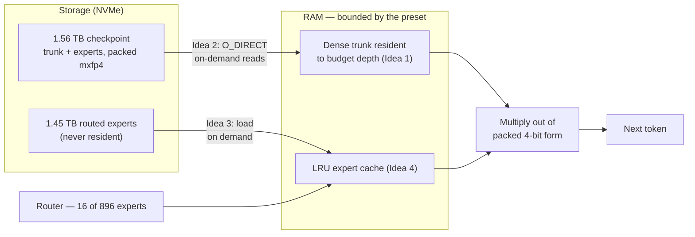
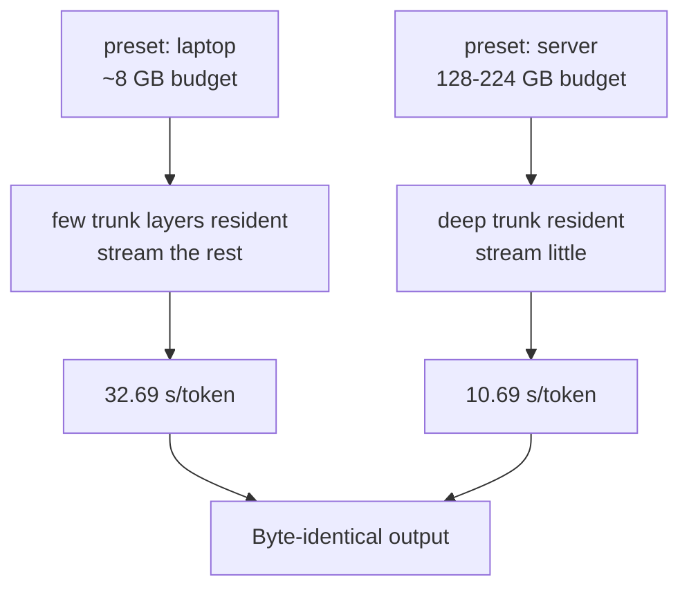
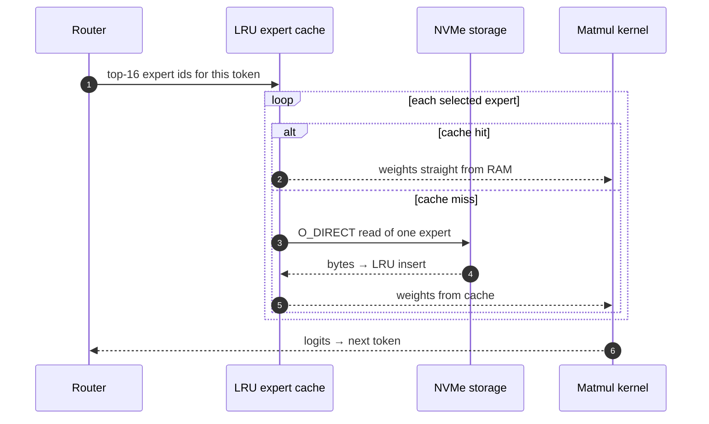
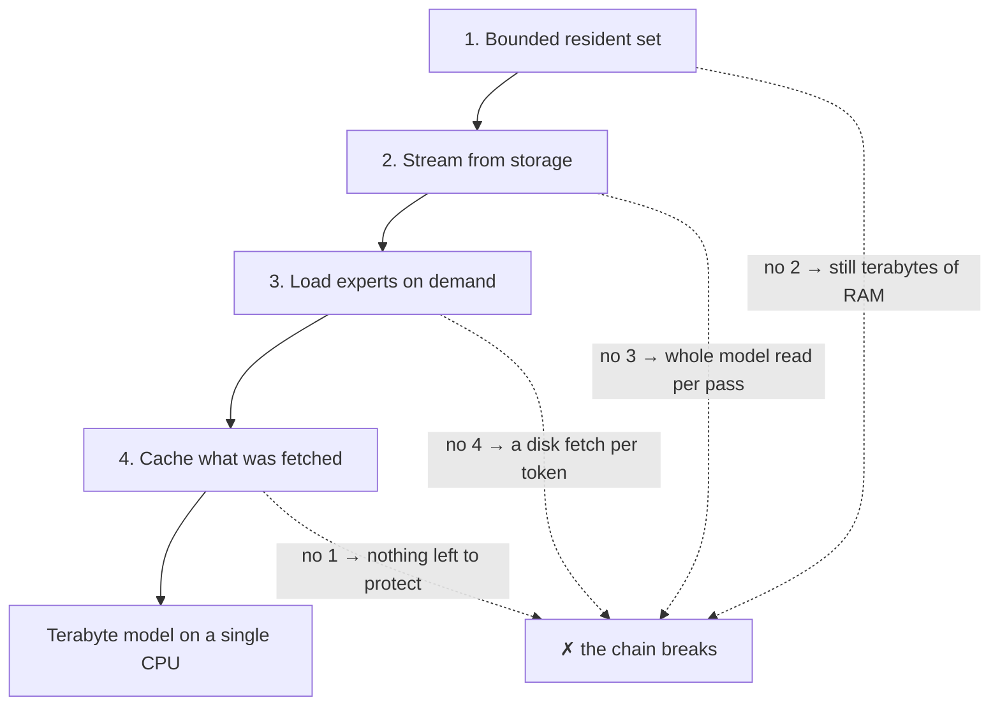
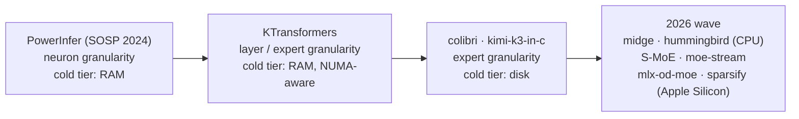
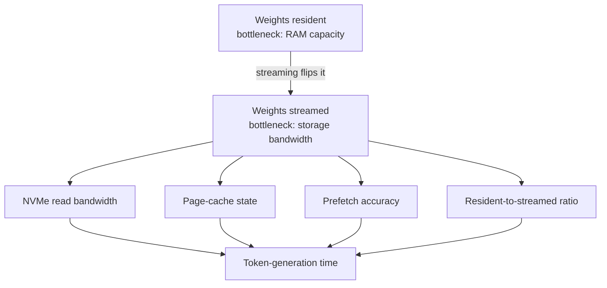

# CPU-First Inference R&D Ideas

A living document cataloguing the engineering ideas that let very large models run on CPU — what each idea is, which project demonstrated it, and what it costs in trade-offs. It starts from the four core ideas behind [kimi-k3-in-c](https://github.com/FareedKhan-dev/kimi-k3-in-c), which run the 2.78T-parameter Kimi K3 MoE model on a single CPU in 8.24 GB RAM, and maps how the wider CPU-first ecosystem implements the same playbook.

---

## Contents

- [The Seed Case: Kimi K3 in C](#the-seed-case-kimi-k3-in-c)
- [Core Idea 1: Keep Only the Essential Resident](#core-idea-1-keep-only-the-essential-resident)
- [Core Idea 2: Stream from Storage, Don't Load](#core-idea-2-stream-from-storage-dont-load)
- [Core Idea 3: Load Experts on Demand](#core-idea-3-load-experts-on-demand)
- [Core Idea 4: Cache What Was Just Fetched](#core-idea-4-cache-what-was-just-fetched)
- [The Memory Budget Dial](#the-memory-budget-dial)
- [Why These Work Together](#why-these-work-together)
- [The Lineage: From Neuron-Level to Expert-Level](#the-lineage-from-neuron-level-to-expert-level)
- [What It Shifts: Storage Replaces RAM as the Constraint](#what-it-shifts-storage-replaces-ram-as-the-constraint)
- [The Playbook Across the Ecosystem](#the-playbook-across-the-ecosystem)
- [R&D Idea Tracker](#rd-idea-tracker)
- [How to Add an Idea](#how-to-add-an-idea)
- [See also](#see-also)

---

## The Seed Case: Kimi K3 in C

[kimi-k3-in-c](https://github.com/FareedKhan-dev/kimi-k3-in-c) is a portable C99 inference engine (Apache 2.0) that runs the **2.78-trillion-parameter Kimi K3** Mixture-of-Experts (MoE) model on a **single CPU in 8.24 GB of RAM** — measured peak RSS — from a **1.56 TB checkpoint**. It depends on no PyTorch, CUDA, TensorRT, or BLAS; the whole engine is ~176 KB and compiles with a C99 compiler and OpenMP. It also ships a tokenizer, model loader, streaming engine, cache management, validation tools, benchmarks, and a CLI.

Its significance is that it changes **how the model is stored, loaded, and accessed** rather than approximating the model itself. Memory usage scales from a modest laptop to a high-memory server with **byte-identical output at every budget** between 8 GB and 224 GB — the memory settings change speed, never correctness. ([Medium write-up](https://medium.com/data-science-in-your-pocket/kimi-k3-runs-on-8gb-cpu-no-gpu-d69f75eaace1), [reported in Runtimes](../README.md#runtimes-and-inference-engines))

The four ideas slot together into a single engine: the resident trunk and the expert cache live in RAM, the checkpoint lives on NVMe, and streams connect them.

The engine's four core ideas are generalizable: they apply to any sparsely activated architecture, not just Kimi K3.

---

## The Memory Budget Dial

The same binary takes the same checkpoint and produces the same tokens at every memory budget; only the amount of trunk held resident — and therefore the streaming pressure — changes. The two documented endpoints bracket the dial:

| Preset | Peak RSS (measured) | Speed (measured) | What the budget buys |
| --- | --- | --- | --- |
| `laptop` | 8.24 GB | 32.69 s/token | Minimal trunk resident; most layers streamed per pass |
| `server` | 127.92 GB | 10.69 s/token | Deep trunk resident; little streaming |

The dial and its consequences:

Because streaming is the throughput bottleneck, the whole thing reduces to a cost model: **token time ≈ max(compute time, storage read time)**. The dial trades one for the other — more RAM buys resident compute, less RAM leans on the disk — and both endpoints answer identically.

---

## Core Idea 1: Keep Only the Essential Resident

**Idea:** keep only the components the model touches on *every* token in memory; stream everything else.

A conventional loader keeps the whole model resident, which for a multi-trillion-parameter checkpoint means terabytes of RAM. kimi-k3-in-c inverts the question: does the entire model actually need to be present at every moment of inference? No. The **dense trunk** — the layers and state used unconditionally — stays resident to whatever depth the memory budget allows, and the rest is read on demand. The memory budget becomes a **dial**: the shipped presets range from `laptop` (~8 GB) to `server` (224 GB), and the engine keeps more trunk resident the more memory it is given.

**Why it matters:** it converts a hard memory floor into a tunable knob. The same engine and the same weights produce identical output whether it is given 8 GB or 224 GB — only the clock changes (measured 32.69 s/token at 8 GB vs 10.69 s/token at the high preset on the same prompt). Supporting reductions keep the always-on working set small: **MLA** collapses attention to a single latent, and **KDA** gives attention a memory that never grows, so the resident KV state does not balloon with context length.

**Trade-off:** the more aggressively you trim the resident set, the more you depend on the next three ideas to feed the model from elsewhere.

---

## Core Idea 2: Stream from Storage, Don't Load

**Idea:** treat storage as an extension of memory and read layers from disk only when a forward pass needs them.

Instead of loading the checkpoint before inference starts — impractical at 1.56 TB — kimi-k3-in-c streams model data out of the checkpoint with `O_DIRECT` reads, on demand. Machines with more RAM keep more resident and stream less; machines with less RAM stream more aggressively. This is what turns "does the model fit?" into "how fast is my disk?".

**Why it matters:** it decouples feasibility from RAM capacity entirely. The model is never resident as a whole — the resident set is bounded by a preset, not by the checkpoint size.

**Trade-off:** token-generation time becomes dominated by storage read latency and bandwidth, which is why fast local NVMe storage is repeatedly highlighted as the biggest performance lever. The measured spread is direct: 32.69 s/token with near-minimal residency versus 10.69 s/token with deep residency — a ~3× swing attributable almost entirely to storage.

---

## Core Idea 3: Load Experts on Demand

**Idea:** in a Mixture-of-Experts model, only the experts the router selects for a token are ever loaded.

MoE models activate a small fraction of parameters per token. Every routed layer in Kimi K3 contains **896 experts, but only 16 are activated per token** — more than 96% of the experts are inactive during any given computation. Keeping all 896 resident is therefore wasteful. kimi-k3-in-c exploits this sparsity at the storage layer: the **1.45 TB of routed experts are never resident**, and are multiplied straight out of their packed 4-bit (mxfp4) form on read.

**Why it matters:** the dominant fraction of a large MoE model's bytes — the experts — can live on disk and be touched only when selected, which is what brings a 2.78T model's working set down to single-digit gigabytes.

**Trade-off:** correctness depends on the router's sparsity holding at inference time; dense attention/trunk layers cannot be skipped this way and still need Ideas 1 and 2.

---

## Core Idea 4: Cache What Was Just Fetched

**Idea:** once an expert is read from storage, keep it around so the next token that routes to it does not re-fetch it.

Naive on-demand loading would re-read the same expert for every token that selects it, turning disk latency into a serial bottleneck. kimi-k3-in-c keeps an **LRU cache of experts** so recently used ones are served from RAM, and sizes that cache from evidence rather than guesswork: the repository replays a **100,096-request expert trace** recorded from a full 93-layer run to produce its expert-cache capacity table. Cache sizing is treated as an optimization problem against a real access pattern, and an accompanying trace simulator replays the workload on the spot.

**Why it matters:** caching is what makes Idea 3 viable at speed — it amortizes the storage reads that Idea 2 introduces, so sparse loading stays fast rather than degenerating into repeated disk I/O.

A single token's expert fetch, with and without a cache hit:

**Trade-off:** a too-small cache thrashes (re-fetching the same experts); a too-large cache crowds out resident trunk layers. The right size is access-pattern-dependent, which is why the project measures it.

---

## Why These Work Together

None of the four ideas is sufficient alone:

- A resident working set without streaming still means a terabyte of RAM.
- Streaming without on-demand loading still reads the entire model per pass.
- On-demand loading without caching turns every token into a disk fetch.
- Caching without a bounded resident set has nothing to protect.

The four ideas are a chain — each one only pays off because the next one exists:

The combination — a small bounded resident set, storage-as-memory streaming, router-driven sparse loading, and trace-sized caching — is what moves the memory floor down to a dial. Every idea is architecture-agnostic: the same playbook applies to any MoE, hybrid, or otherwise sparsely activated model on CPU, and variants of it already appear in [colibri](https://github.com/JustVugg/colibri) (disk-tiered MoE runtime with router-ahead prefetch) and [TurboFieldfare](https://github.com/drumih/turbo-fieldfare) (expert streaming on Apple Silicon). By mid-2026 the playbook had spread across a whole generation of engines — [midge](https://github.com/drmihirbrahme/midge), [hummingbird](https://github.com/prayangshuuu/hummingbird), [S-MoE](https://github.com/melasistema/s-moe), [moe-stream](https://github.com/GOBA-AI-Labs/moe-stream), [mlx-od-moe](https://github.com/kqb/mlx-od-moe), and [sparsify](https://github.com/daylinkltd/sparsify) — which [The Lineage](#the-lineage-from-neuron-level-to-expert-level) section below places in context.

---

## The Lineage: From Neuron-Level to Expert-Level

The four ideas above are the latest step in a research line that predates the MoE-mania, and the *trigger mechanism* changed along the way:

- **[PowerInfer](https://arxiv.org/abs/2312.12456) (SOSP 2024)** — the original hot/cold split at *neuron* granularity. Profile which neurons activate most (a skewed power-law distribution), keep the hot neurons resident, compute the cold ones on the CPU on demand. It is a GPU-CPU hybrid and needs ReLU-family activation sparsity to shine, so it never fit the CPU-first bar — but its locality insight is the seed of this document's ideas.
- **[KTransformers](../README.md#mixture-of-experts-on-cpu)** — moved the split up to *layer/expert* granularity: hot experts resident, cold experts on the other tier, with NUMA-aware scheduling.
- **[colibri](https://github.com/JustVugg/colibri)** and **[kimi-k3-in-c](https://github.com/FareedKhan-dev/kimi-k3-in-c)** — made the cold tier *disk* rather than RAM, and added router-aware prefetch plus trace-sized LRU caches.
- **The 2026 wave** — [midge](https://github.com/drmihirbrahme/midge) and [hummingbird](https://github.com/prayangshuuu/hummingbird) generalised the approach to any MoE family on CPU, while the Apple-Silicon engines ([TurboFieldfare](../README.md#on-device-edge-arm-and-sbcs), [S-MoE](https://github.com/melasistema/s-moe), [moe-stream](https://github.com/GOBA-AI-Labs/moe-stream), [mlx-od-moe](https://github.com/kqb/mlx-od-moe), [sparsify](https://github.com/daylinkltd/sparsify)) streamed experts from SSD on consumer hardware — and [BigMoeOnEdge](https://github.com/Helldez/BigMoeOnEdge) proved the playbook on a phone, streaming a 284B model (~91 GB) from flash on a 12 GB device's CPU at ~1 tok/s.

Two things moved across this line. The **granularity** went from neuron → expert, so the engines now exploit MoE *router output* instead of *activation sparsity* — which is why they work on dense-activation (SwiGLU/GELU) models with no special training. And the **cold tier** went from RAM → storage, so the bottleneck shifted from capacity to bandwidth and prefetch accuracy — which is where the newest ideas (learned shadow-model prefetch, io_uring pumps) are aimed.

---

## What It Shifts: Storage Replaces RAM as the Constraint

The most consequential side effect is a change in where the system's bottleneck lives. When model weights are streamed rather than resident, **storage architecture matters as much as RAM**: NVMe read bandwidth and latency, page-cache state, prefetch behaviour, and the ratio of resident-to-streamed layers all directly move token-generation time. This is an unfamiliar axis for an AI community that spent years optimising GPU memory, and it opens a set of under-explored questions — most of them now tracked below.

---

## The Playbook Across the Ecosystem

Every engine in the 2026 generation implements the same four ideas, differing mainly in *how* they implement Idea 4 (the cache/prefetch tier). Legend: ✅ implemented, ◐ partial, ✗ not in this engine, — not applicable.

| Project | 1. Resident set | 2. Stream from storage | 3. Experts on demand | 4. Cache / prefetch | Weights |
| --- | --- | --- | --- | --- | --- |
| [kimi-k3-in-c](https://github.com/FareedKhan-dev/kimi-k3-in-c) | ✅ trunk to preset depth | ✅ O_DIRECT | ✅ | ✅ trace-sized LRU | original |
| [colibri](https://github.com/JustVugg/colibri) | ✅ dense layers | ✅ disk-tiered | ✅ | ✅ router-ahead prefetch | original |
| [midge](https://github.com/drmihirbrahme/midge) | ✅ dense trunk | ✅ mmap + page cache | ✅ | ✅ OS page cache | original |
| [hummingbird](https://github.com/prayangshuuu/hummingbird) | ✅ | ✅ io_uring | ✅ | ✅ async prefetch | original |
| [TurboFieldfare](https://github.com/drumih/turbo-fieldfare) | ✅ | ✅ SSD | ✅ | ✅ expert streaming | original |
| [S-MoE](https://github.com/melasistema/s-moe) | ◐ | ✅ NVMe Direct I/O | ✅ | ✅ ring-buffer LRU + prefetch | original |
| [moe-stream](https://github.com/GOBA-AI-Labs/moe-stream) | ✅ | ✅ | ✅ | ✅ | original |
| [mlx-od-moe](https://github.com/kqb/mlx-od-moe) | ✅ mmap | ✅ mmap | ✅ | ✅ shadow-model prefetch | original |
| [sparsify](https://github.com/daylinkltd/sparsify) | ✅ | ✅ SSD paging | ✅ | ✅ router-selected paging | original |
| [BigMoeOnEdge](https://github.com/Helldez/BigMoeOnEdge) | ✅ resident core | ✅ flash streaming | ✅ | ✅ capped expert cache | original |
| [KTransformers](../README.md#mixture-of-experts-on-cpu) | ✅ hot experts | ✗ (RAM-tiered, not disk) | ✅ | ✅ hot/cold split | original |
| [PowerInfer](https://arxiv.org/abs/2312.12456) | ✅ hot neurons | ✗ (GPU-CPU hybrid) | — (dense model) | — | original |

Where the engines diverge is Idea 4: an LRU sized by a replayed trace (kimi-k3-in-c), a ring buffer with Direct-I/O prefetch (S-MoE), io_uring pumps (hummingbird), an mmap-backed page cache (midge, mlx-od-moe), a learned shadow model that predicts the next experts (mlx-od-moe), or a user-set capped cache that keeps the rest of the phone alive (BigMoeOnEdge).

---

## R&D Idea Tracker

The tracker is the scope of this document: a running log of ideas that accelerate CPU-first inference, each with a status and a reference implementation to study. `Demonstrated` means a shipping open-source project proves it; `Tracked` means it is a candidate worth prototyping.

| Idea | Status | Proven in | Notes |
| --- | --- | --- | --- |
| Bounded resident working set (memory-as-dial presets) | Demonstrated | [kimi-k3-in-c](https://github.com/FareedKhan-dev/kimi-k3-in-c) | Byte-identical output from 8 GB to 224 GB; changes speed, never correctness |
| Storage-as-memory streaming (O_DIRECT, on-demand layer reads) | Demonstrated | [kimi-k3-in-c](https://github.com/FareedKhan-dev/kimi-k3-in-c), [colibri](https://github.com/JustVugg/colibri), [midge](https://github.com/drmihirbrahme/midge), [hummingbird](https://github.com/prayangshuuu/hummingbird), [BigMoeOnEdge](https://github.com/Helldez/BigMoeOnEdge) | Storage speed becomes the dominant token-time factor |
| Router-selected on-demand expert loading (sparse activation) | Demonstrated | [kimi-k3-in-c](https://github.com/FareedKhan-dev/kimi-k3-in-c), [colibri](https://github.com/JustVugg/colibri), [midge](https://github.com/drmihirbrahme/midge), [hummingbird](https://github.com/prayangshuuu/hummingbird), [BigMoeOnEdge](https://github.com/Helldez/BigMoeOnEdge) | 16 of 896 experts active per token; experts never resident |
| LRU expert cache sized from a replayed access trace | Demonstrated | [kimi-k3-in-c](https://github.com/FareedKhan-dev/kimi-k3-in-c) | 100,096-request trace + capacity table + trace simulator |
| Router-ahead expert prefetch | Demonstrated | [colibri](https://github.com/JustVugg/colibri), [S-MoE](https://github.com/melasistema/s-moe) | Prefetch hides disk latency before the router confirms |
| Learned shadow-model expert prefetch (predict next top-K before the router fires) | Demonstrated | [mlx-od-moe](https://github.com/kqb/mlx-od-moe) | Shadow model reads hidden states and queues async prefetches |
| OS page-cache / mmap expert paging (kernel as the L3 cache) | Demonstrated | [midge](https://github.com/drmihirbrahme/midge), [mlx-od-moe](https://github.com/kqb/mlx-od-moe) | Memory-mapped experts let the kernel page cache absorb re-fetches |
| io_uring / Direct I/O async prefetch pumps | Demonstrated | [hummingbird](https://github.com/prayangshuuu/hummingbird), [S-MoE](https://github.com/melasistema/s-moe) | Coalesced streaming reads hide disk latency behind compute |
| Spec-driven model-agnostic engines (one binary, many MoE families) | Demonstrated | [midge](https://github.com/drmihirbrahme/midge), [hummingbird](https://github.com/prayangshuuu/hummingbird) | Adding a model family is a spec + tensor map, not a new engine |
| KV cache on disk / NVMe (context-length unbounded) | Demonstrated | [Reame](https://github.com/c0debrain/reame), [rwkv.cpp](https://github.com/RWKV/rwkv.cpp) | Disk-backed KV cache; RWKV O(1) memory per token |
| Sub-byte packed formats as a storage/reference standard (mxfp4) | Demonstrated | [kimi-k3-in-c](https://github.com/FareedKhan-dev/kimi-k3-in-c), [midge](https://github.com/drmihirbrahme/midge), [moe-stream](https://github.com/GOBA-AI-Labs/moe-stream) | Experts multiplied straight out of packed 4-bit form |
| Trace-driven cache-capacity tuning methodology | Demonstrated | [kimi-k3-in-c](https://github.com/FareedKhan-dev/kimi-k3-in-c) | Optimisation against real access patterns, not guesses |
| Speculative expert prefetch (predict next token's experts before sampling) | Tracked | — | Next step beyond router-ahead: predict *which* experts the next tokens will route to |
| Adaptive trunk residency (hot layers resident, cold streamed, by trace) | Tracked | — | Generalises fixed presets into a learned memory-residency policy |
| Standardised cross-runtime streaming model format | Tracked | — | A single on-disk layout both llama.cpp and dedicated MoE engines could stream |
| Storage-aware scheduling on NUMA (place streams on the socket's disk) | Tracked | — | Combine kimi-k3-in-c streaming with [ArcLight](https://github.com/OpenBMB/ArcLight) NUMA topology awareness |
| Multiplication-free / ternary kernels for the streaming path | Tracked | — | [FairyFuse](https://arxiv.org/abs/2607.17751) shows 3.6× over GGML; unexplored combined with disk streaming |

---

## How to Add an Idea

1. Confirm it is **CPU-first relevant** — an engineering technique that lets more/bigger models run on CPU, or shifts a CPU inference bottleneck (see [CONTRIBUTING](../CONTRIBUTING.md)).
2. Add a row to the [R&D Idea Tracker](#rd-idea-tracker). Mark `Demonstrated` only with a reference implementation; otherwise `Tracked`.
3. If the idea has a runnable implementation, note it in the README's relevant section and link it here.
4. Open a PR — the standard checks (ToC, snippets, link check) run in CI.

---

## See also

- [kimi-k3-in-c](https://github.com/FareedKhan-dev/kimi-k3-in-c) — the reference implementation
- [Kimi K3 runs on 8GB CPU, No GPU (Medium, Aug 2026)](https://medium.com/data-science-in-your-pocket/kimi-k3-runs-on-8gb-cpu-no-gpu-d69f75eaace1) — the write-up this document summarises
- [PowerInfer (SOSP 2024)](https://arxiv.org/abs/2312.12456) — the neuron-level ancestor of the expert-level playbook
- [midge](https://github.com/drmihirbrahme/midge) and [hummingbird](https://github.com/prayangshuuu/hummingbird) — CPU engines proving the same ideas at model-family scale
- [S-MoE](https://github.com/melasistema/s-moe), [moe-stream](https://github.com/GOBA-AI-Labs/moe-stream), [mlx-od-moe](https://github.com/kqb/mlx-od-moe), and [sparsify](https://github.com/daylinkltd/sparsify) — Apple-Silicon variants of the same playbook
- [Mixture-of-Experts on CPU](../README.md#mixture-of-experts-on-cpu) — MoE runtimes and evidence in the main list
- [CPU-Native Model Catalog](cpu-native-models.md) — architectures and quantization well suited to CPU
- [CPU AI Gap Map](cpu-ai-gap-map.md) — where the CPU tooling ecosystem is mature vs. missing
- [Benchmark Methodology](benchmark-methodology.md) — how to measure these ideas comparably
- [Roadmap](../ROADMAP.md) — where R&D ideas feed into deliverables
