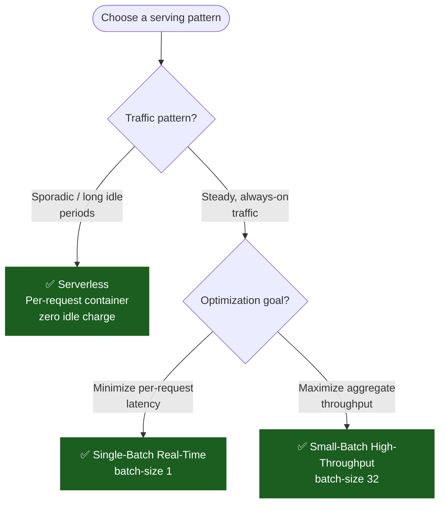

# CPU Inference Deployment Guide

Best practices for deploying CPU inference in production — covering Docker, Kubernetes, system tuning, and serving patterns. This doc assumes you have already selected a runtime (e.g., llama.cpp, ONNX Runtime, OpenVINO) and want to run it efficiently on CPU hardware.

---

## Contents

- [Docker](#docker)
- [Kubernetes](#kubernetes)
- [System Tuning](#system-tuning)
- [NUMA and Multi-Socket](#numa-and-multi-socket)
- [Serving Patterns](#serving-patterns)
- [See also](#see-also)
- [References](#references)

---

## Docker

### CPU Thread Control

CPU inference benefits significantly from controlling thread counts and pinning. Set these environment variables in your Dockerfile or `docker run`:

```dockerfile
ENV OMP_NUM_THREADS=8
ENV MKL_NUM_THREADS=8
ENV NUMEXPR_NUM_THREADS=8
```

Run with CPU pinning via `--cpuset-cpus`:

```bash
docker run --rm \
  --cpuset-cpus="0-7" \
  --memory="16g" \
  -e OMP_NUM_THREADS=8 \
  -e MODEL_PATH=/models/llama-3.2-3b-q4.gguf \
  my-cpu-inference-service
```

### NUMA Awareness in Docker

On multi-socket hosts, constrain inference to one NUMA node to avoid cross-socket memory latency:

```bash
docker run --rm \
  --cpuset-cpus="0-31" \
  --cpuset-mems="0" \
  -e OMP_NUM_THREADS=32 \
  my-cpu-inference-service
```

`--cpuset-mems="0"` pins memory allocations to NUMA node 0, keeping all inference memory local.

### Memory-Mapped Models

GGUF models support memory-mapped loading, which avoids allocating separate RAM for model weights. Ensure the container has sufficient virtual address space:

```bash
docker run --rm \
  --shm-size=4g \
  --ulimit memlock=-1 \
  -v /path/to/models:/models:ro \
  my-cpu-inference-service \
    --model /models/llama-3.2-3b-q4.gguf \
    --mlock
```

`--mlock` in llama.cpp pins model pages to RAM, preventing swap-induced latency spikes.

---

## Kubernetes

### Resource Requests and Limits

Set CPU requests equal to limits to prevent CPU throttling, which is especially harmful for latency-sensitive inference:

```yaml
resources:
  requests:
    cpu: 8
    memory: 16Gi
  limits:
    cpu: 8
    memory: 16Gi
```

### CPU Manager and Static Policy

For workloads sensitive to CPU cache affinity (most inference falls here), enable the static CPU manager policy on your kubelet and use `Guaranteed` QoS:

```yaml
apiVersion: v1
kind: Pod
metadata:
  name: cpu-inference-pod
spec:
  containers:
  - name: inference
    image: my-cpu-inference:latest
    resources:
      requests:
        cpu: 8
        memory: 16Gi
      limits:
        cpu: 8
        memory: 16Gi
    env:
    - name: OMP_NUM_THREADS
      value: "8"
    - name: NUMEXPR_NUM_THREADS
      value: "8"
```

With the static policy, kubelet pins the container's processes exclusively to `cpu 0-7`, preserving L2/L3 cache locality. Without this, context switches between cores evict cache lines and reduce throughput by 15–40%.

### NUMA Alignment in K8s

If your nodes are multi-socket, enable [Topology Manager](https://kubernetes.io/docs/tasks/administer-cluster/topology-manager/) with `single-numa-node` policy:

```yaml
# kubelet config
featureGates:
  KubeletPodResourcesGetAllocatable: true
topologyManagerPolicy: single-numa-node
```

This ensures that both CPU and memory are allocated from the same NUMA node, avoiding cross-socket memory access that can halve inference throughput.

### Horizontal Pod Autoscaling

CPU inference scales horizontally well since each pod handles its own request independently. Use HPA based on CPU utilization:

```yaml
apiVersion: autoscaling/v2
kind: HorizontalPodAutoscaler
metadata:
  name: cpu-inference-hpa
spec:
  scaleTargetRef:
    apiVersion: apps/v1
    kind: Deployment
    name: cpu-inference
  minReplicas: 2
  maxReplicas: 20
  metrics:
  - type: Resource
    resource:
      name: cpu
      target:
        type: Utilization
        averageUtilization: 70
```

Cost advantage: at low traffic the HPA scales to 0 (with serverless K8s like KEDA + Karpenter) or to a single pod — idle GPU costs do not apply.

---

## System Tuning

### Thread Pinning with numactl

```bash
numactl --cpunodebind=0 --membind=0 \
  ./llama-server --model llama-3.2-3b-q4.gguf \
    --threads 32 --threads-batch 32
```

Key flags:
- `--cpunodebind=0` — pin to NUMA node 0
- `--membind=0` — allocate memory on node 0
- `--threads` / `--threads-batch` — llama.cpp-specific thread control

### Frequency Scaling Governor

For sustained inference throughput, set the CPU governor to `performance`:

```bash
sudo cpupower frequency-set -g performance
```

This disables frequency scaling and keeps cores at max turbo, reducing tail latency by 10–30% compared to the `powersave` or `ondemand` governors.

### Disable Hyper-Threading (Optional)

On high-core-count Xeon servers, inference throughput sometimes improves by disabling SMT/Hyper-Threading, especially when thread count already saturates physical cores:

```bash
echo off | sudo tee /sys/devices/system/cpu/smt/control
```

Benchmark both configurations — on some architectures SMT adds noise without throughput gain for memory-bound LLM inference.

---

## NUMA and Multi-Socket

Multi-socket servers (common in cloud bare-metal and on-prem) introduce NUMA domains. A memory access to a remote socket's RAM costs 1.5–2× the latency of a local access.

### Single-Socket Binding (Recommended)

Pin the entire inference process to one socket. The second socket stays available for preprocessing or other workloads.

```
Socket 0 (CPU 0-63)   →  llama.cpp / ONNX Runtime
Socket 1 (CPU 64-127) →  tokenizer, post-processing, API server
```

### Cross-Socket Round-Robin

For very large models where single-socket RAM is insufficient, distribute threads across both sockets with interleaved memory allocation:

```bash
numactl --interleave=all \
  ./llama-server --model llama-3.1-70b-q4.gguf \
    --threads 64 --threads-batch 64 \
    --numa spread
```

Use `--numa spread` in llama.cpp (available since b4043) to distribute memory across NUMA nodes and bind worker threads to their local node.

---

## Serving Patterns



### Single-Batch Real-Time

Best for: chatbots, code completion, interactive agents.

```bash
numactl --cpunodebind=0 --membind=0 \
  ./llama-server \
    --model llama-3.2-3b-q4.gguf \
    --threads 8 \
    --threads-batch 8 \
    --ctx-size 8192 \
    --batch-size 1
```

Keep `--batch-size 1` for minimal latency.

### Small-Batch High-Throughput

Best for: embedding generation, classification, summarization pipelines.

```bash
numactl --cpunodebind=0 --membind=0 \
  ./llama-server \
    --model llama-3.2-3b-q4.gguf \
    --threads 32 \
    --threads-batch 32 \
    --ctx-size 4096 \
    --batch-size 32
```

### Serverless (Per-Request Container)

Best for: sporadic workloads with long idle periods.

Package the model + runtime in a container and deploy on AWS Lambda (arm64), Fly.io, Modal, or similar. Each invocation starts a fresh container — total cost is proportional to inference time × memory, with zero idle charge.

```python
# Example: Modal CPU inference
@app.function(cpu=2.0, memory=4096)
def generate(prompt: str) -> str:
    result = subprocess.run(
        ["./llama-cli", "--model", MODEL, "--prompt", prompt],
        capture_output=True, text=True
    )
    return result.stdout
```

---

## See also

- [Serverless CPU Patterns](serverless-patterns.md)
- [Benchmark Methodology](benchmark-methodology.md)
- [Cost Calculator](cost-calculator.md)
- [Troubleshooting](troubleshooting.md)
- [Model Conversion Guide](model-conversion-guide.md)

---

## References

- [Topology Manager](https://kubernetes.io/docs/tasks/administer-cluster/topology-manager/)
