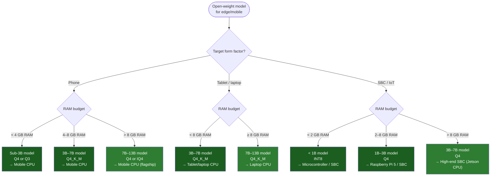

# Edge & Mobile CPU Inference Playbook

A definitive reference for deploying open-weight models on edge devices, mobile phones, and single-board computers — entirely on CPU. No GPU, no NPU dependency, no cloud round-trip.

---

## Contents

- [Why Edge/Mobile CPU Matters](#why-edgemobile-cpu-matters)
- [Decision Flow](#decision-flow)
- [Model Selection](#model-selection)
- [Hardware Targets](#hardware-targets)
- [Runtimes by Platform](#runtimes-by-platform)
- [Performance Budgets](#performance-budgets)
- [Deployment Checklist](#deployment-checklist)
- [See also](#see-also)

---

## Why Edge/Mobile CPU Matters

Open-weight models (Llama 3.2, Phi-3.5, Qwen 2.5, Gemma 2, DeepSeek-R1-Distill) have driven a fundamental shift: a 3B parameter model quantized to 4-bit fits in ~2 GB of RAM and runs at interactive speeds on a phone or Raspberry Pi. The CPU is the only compute substrate guaranteed to be present on every device — no GPU, no NPU, no vendor-specific accelerator.

Three converging trends make edge/mobile CPU inference the default deployment target:

1. **Model efficiency** — Distillation and quantization have compressed capable models below 3 GB. Phi-3.5-mini (3.8B) at Q4 runs at 25+ tok/s on an iPhone 15 Pro. The median downloaded model on Hugging Face is 406M params.
2. **CPU capability** — Modern mobile CPUs (Apple A19 Pro, Snapdragon 8 Elite, Dimensity 9500) deliver 5–12 tok/s on 7B Q4 models. SME2 instructions in Arm v9.3 add up to 6× throughput for free.
3. **User expectation shift** — Users expect AI features to work offline, without cloud latency, and without sharing data with a third party. CPU inference is the only path that satisfies all three on every device.

This playbook consolidates the project's edge/mobile content into a single decision guide. Use it to choose your model, target hardware, runtime, and deployment strategy.

---

## Decision Flow

---

## Model Selection

| Device Tier | Max Param (Q4) | Recommended Models | Quant Format |
|---|---|---|---|
| Budget phone (< 4 GB) | 1B–3B | Llama-3.2-1B, Qwen-2.5-1.5B, Gemma-2-2B | Q4_K_M, Q3_K_M |
| Mid-range phone (4–6 GB) | 3B–7B | Llama-3.2-3B, Phi-3.5-mini-3.8B, Qwen-2.5-3B | Q4_K_M, Q5_K_M |
| Flagship phone (8–12 GB) | 7B–13B | Llama-3.1-8B, Mistral-7B, Qwen-2.5-7B, DeepSeek-R1-Distill-7B | Q4_K_M, IQ4_XS |
| Laptop (8–16 GB) | 7B–13B | Same as flagship phone, plus larger context | Q4_K_M, Q6_K |
| SBC — Pi 5 (8 GB) | 1B–3B | Llama-3.2-1B/3B, Phi-3.5-mini | Q4_K_M |
| SBC — high-end | 3B–7B | Same as mid-range phone | Q4_K_M |

See [Model Conversion Guide](model-conversion-guide.md) for quantization procedures and format selection guidance.

---

## Hardware Targets

See [Hardware Reference](hardware-reference.md) for the authoritative performance catalogue for all edge/mobile devices — mobile chipsets ([Mobile Phones](hardware-reference.md#mobile-phones)), [laptops](hardware-reference.md#laptops--edge-servers), and [SBCs](hardware-reference.md#single-board-computers) — with throughput figures and pricing. Per-chipset detail and benchmark sources live in [Mobile Phone CPU Inference](mobile-cpu-inference.md).

---

## Runtimes by Platform

See the [Runtimes comparison table](../README.md#runtimes-and-inference-engines) in the README for the full catalogue of runtimes with architecture, format, and OS compatibility. The README is the canonical source — this playbook references it rather than duplicating the table.

Key selection guidance for edge/mobile:

- **iOS**: MLC-LLM (prebuilt App Store app, lowest friction) or Apple Core AI (Xcode project, deeper integration)
- **Android**: llama.cpp Android (GGUF, most flexible), ExecuTorch (PyTorch-native), or MLC-LLM Android
- **Browser**: WebLLM (MLC format, OpenAI-compatible API) or Transformers.js (ONNX, 200+ architectures)
- **Linux SBC**: llama.cpp (GGUF) or whisper.cpp (speech-to-text)

---

## Performance Budgets

| Use Case | Max Acceptable TTFT | Min Tok/s | Context Length |
|---|---|---|---|
| Chat / assistant | 500 ms | 15 tok/s | 2K–8K |
| Code completion | 200 ms | 25 tok/s | 1K–4K |
| Translation | 1,000 ms | 5 tok/s | 512–2K |
| Summarization | 2,000 ms | 3 tok/s | 4K–8K |
| Text classification | 100 ms | — | 128–512 |
| Speech-to-text (real-time) | 300 ms | 1× real-time | — |

If your target hardware cannot meet these budgets, consider: (a) a smaller model, (b) more aggressive quantization, (c) pruning/distillation, or (d) accepting a cloud round-trip for that specific workload.

---

## Deployment Checklist

- [ ] **Model selected** — params fit RAM with quantization headroom (aim for ≤ 70% RAM utilization)
- [ ] **Quantization format chosen** — GGUF for llama.cpp, ONNX for LiteRT/ONNX Runtime, MLC for WebLLM/MLC-LLM
- [ ] **Runtime confirmed** — works on target OS and CPU architecture (x86, ARM, WASM)
- [ ] **Context length tested** — long contexts may OOM; verify with realistic prompt lengths
- [ ] **Latency budget verified** — TTFT and tok/s measured on target hardware (not a dev machine)
- [ ] **Thermal behavior tested** — sustained inference throttles on fanless devices; measure throughput over 5+ minutes
- [ ] **Offline path working** — model loads and runs with no network access
- [ ] **Optimizations applied** — thread count pinned, governor set to performance, NUMA if multi-socket
- [ ] **Fallback strategy** — if CPU inference fails or is too slow, degrade gracefully (smaller model or cloud fallback)

---

## See also

- [Mobile Phone CPU Inference](mobile-cpu-inference.md) — Full chipset and runtime catalogue with benchmarks
- [On-Device, Edge, ARM, and SBCs (README)](../README.md#on-device-edge-arm-and-sbcs) — Additional hardware and runtime entries
- [Model Conversion Guide](model-conversion-guide.md) — Quantization walkthroughs for GGUF, ONNX, and TFLite
- [Benchmark Methodology](benchmark-methodology.md) — Standardized metrics for measuring edge/mobile throughput
- [Quick Start Guide](quickstart.md) — Three paths to running CPU inference in minutes
- [WebLLM Documentation](https://llm.mlc.ai/docs/deploy/webllm.html) — In-browser CPU inference
