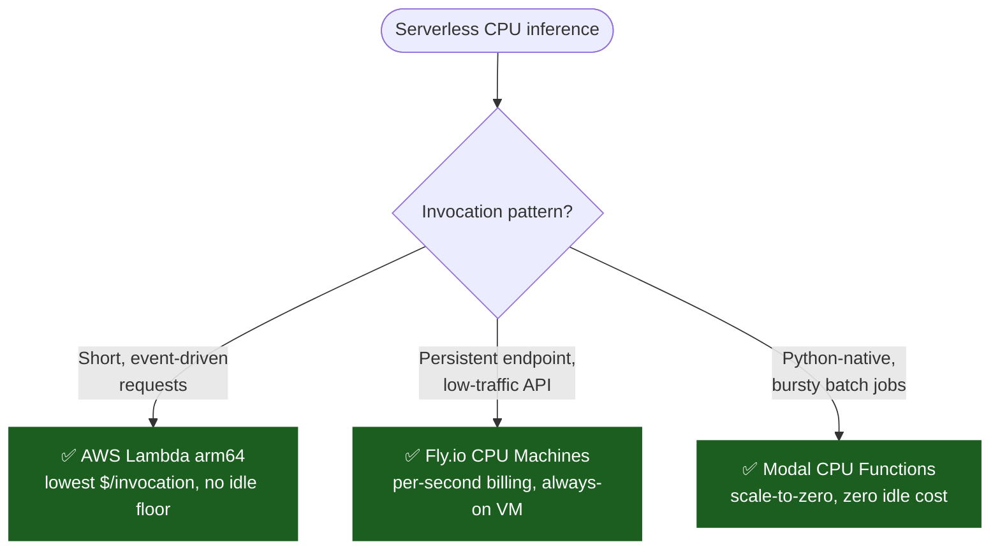

# Serverless CPU Inference Patterns

Recipes for deploying CPU inference on serverless platforms, with cost-per-invocation worked examples. Serverless eliminates the idle-cost problem entirely — you pay only for the milliseconds your inference actually runs.

---

## Contents

- [Choosing a Platform](#choosing-a-platform)
- [AWS Lambda (arm64 / Graviton2)](#aws-lambda-arm64--graviton2)
- [Fly.io CPU Machines](#flyio-cpu-machines)
- [Modal CPU Functions](#modal-cpu-functions)
- [Cost Comparison](#cost-comparison)
- [See also](#see-also)

---

## Choosing a Platform



---

## AWS Lambda (arm64 / Graviton2)

Lambda arm64 (Graviton2) offers the lowest per-invocation cost for CPU inference. Best for embedding generation, classification, and small-model generation.

### Package llama.cpp as a Lambda Layer

```bash
# Build llama.cpp as a static binary for arm64
git clone https://github.com/ggerganov/llama.cpp
cd llama.cpp
cmake -B build -DCMAKE_BUILD_TYPE=Release -DCMAKE_C_FLAGS="-static"
cmake --build build --config Release -j

# Package as Lambda layer
mkdir -p layer/bin
cp build/bin/llama-server layer/bin/
cd layer && zip -r ../llama-layer.zip .
```

### Lambda Function

```python
import json
import subprocess
import os

MODEL = "/opt/models/llama-3.2-1b-q4_k_m.gguf"
LLAMA_CLI = "/opt/bin/llama-cli"

def handler(event, context):
    prompt = event.get("prompt", "Hello")
    result = subprocess.run(
        [LLAMA_CLI, "--model", MODEL, "--prompt", prompt,
         "--threads", "2", "-n", "128", "--no-display-prompt"],
        capture_output=True, text=True, timeout=30
    )
    return {"statusCode": 200, "body": result.stdout}
```

### Cost per Invocation

```
Lambda arm64 (1024 MB, 2 vCPU):
  ~2.5 s average inference @ $0.00001333/100ms
  = $0.000333/invocation
  = $0.33/1,000 invocations
```

At 10,000 invocations/day: **~$100/mo** — no idle cost, no minimum.

---

## Fly.io CPU Machines

Fly.io runs containers on CPU VMs with per-second billing. Best for low-traffic LLM APIs where you want a persistent endpoint without GPU idle costs.

### Dockerfile

```dockerfile
FROM ubuntu:22.04

RUN apt-get update && apt-get install -y --no-install-recommends \
    build-essential cmake curl ca-certificates

COPY llama.cpp /llama.cpp
RUN cd /llama.cpp && cmake -B build && cmake --build build --config Release -j
COPY models/llama-3.2-3b-q4_k_m.gguf /models/

ENV OMP_NUM_THREADS=4
EXPOSE 8080
CMD ["/llama.cpp/build/bin/llama-server", \
     "--model", "/models/llama-3.2-3b-q4_k_m.gguf", \
     "--host", "0.0.0.0", "--port", "8080"]
```

### fly.toml

```toml
app = "my-cpu-inference"
primary_region = "iad"

[build]
  dockerfile = "Dockerfile"

[[services]]
  port = 8080
  internal_port = 8080
  protocol = "tcp"

  [[services.ports]]
    port = 80
    handlers = ["http"]

  [[services.concurrency]]
    type = "requests"
    hard_limit = 10
```

### Cost

```
Fly.io shared CPU (1-4 vCPU, 4-8 GB RAM):
  ~$0.002/sec to $0.005/sec

At 100 req/hr, 3 s average inference:
  = $0.005 × 3 × 100 × 730 / 3600
  = ~$0.30/mo compute cost
  + $1.94/mo for always-on VM (shared 256 MB)
  = ~$2.24/mo total
```

---

## Modal CPU Functions

Modal lets you define CPU inference as a Python function, with automatic scaling to zero and no standing infrastructure.

### Modal App

```python
import modal

app = modal.App("cpu-inference")
image = modal.Image.debian_slim().apt_install(
    "build-essential", "cmake"
).run_commands(
    "git clone https://github.com/ggerganov/llama.cpp /llama.cpp",
    "cd /llama.cpp && cmake -B build && cmake --build build -j"
).copy_local_file(
    "models/llama-3.2-3b-q4_k_m.gguf", "/models/llama-3.2-3b-q4_k_m.gguf"
)

@app.function(
    cpu=2.0,
    memory=4096,
    image=image,
    timeout=60,
)
def generate(prompt: str) -> str:
    import subprocess
    result = subprocess.run(
        ["/llama.cpp/build/bin/llama-cli",
         "--model", "/models/llama-3.2-3b-q4_k_m.gguf",
         "--prompt", prompt,
         "--threads", "2", "-n", "128"],
        capture_output=True, text=True
    )
    return result.stdout
```

### Cost

```
Modal CPU (2 CPU, 4 GB):
  ~$0.000043/sec
  ~3 s average inference = $0.000129/invocation
  = $0.129/1,000 invocations

At 10,000 invocations/day: ~$39/mo with zero idle cost.
```

---

## Cost Comparison

| Platform | Compute unit | Cost/1K invocations | Idle cost | Best for |
|---|---|---|---|---|
| AWS Lambda arm64 | 1 GB, 2 vCPU, ~2.5 s | ~$0.33 | $0 | Embeddings, classification, small gen |
| Fly.io shared CPU | 4 vCPU, 4 GB, always-on* | ~$0.02 | ~$2/mo | Low-traffic persistent endpoint |
| Modal CPU | 2 CPU, 4 GB, ~3 s | ~$0.13 | $0 | Bursty inference from Python |

\* Fly.io charges for the VM even when idle (per-second, not per-invocation).

**Rule of thumb**: If your inference runs fewer than 100,000 invocations/month, serverless CPU is cheaper than any GPU option — the GPU's minimum instance cost alone will exceed your total serverless bill.

---

## See also

- [Cost Calculator](cost-calculator.md)
- [CPU Inference Deployment Guide](cpu-inference-deployment.md)
- [Benchmark Methodology](benchmark-methodology.md)
- [Green Inference Guide](green-inference.md)
