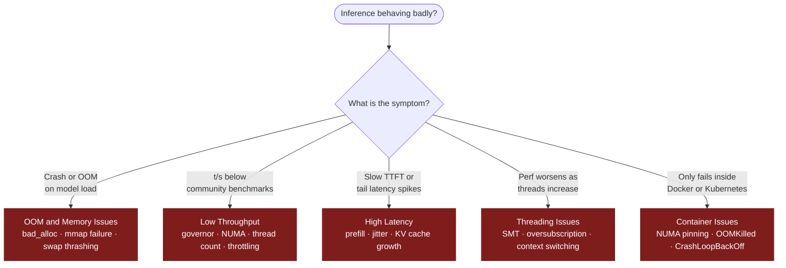

# Troubleshooting CPU Inference

Common issues when deploying and running CPU inference, with root causes and fixes.

---

## Contents

- [Quick Diagnosis](#quick-diagnosis)
- [OOM and Memory Issues](#oom-and-memory-issues)
- [Low Throughput](#low-throughput)
- [High Latency](#high-latency)
- [Threading Issues](#threading-issues)
- [Container Issues](#container-issues)
- [See also](#see-also)
- [References](#references)

---

## Quick Diagnosis



---

## OOM and Memory Issues

### Model fails to load — "bad_alloc" or OOM

**Root cause**: The quantized model + KV cache exceed available RAM.

**Fix**: Calculate memory requirements first:

```bash
# Estimate memory for a Q4 model
# model_size = params × bytes_per_param
# 7B Q4_K_M: 7e9 × 0.5 bytes = ~3.5 GB weights
# KV cache (8K context): 2 × 8192 × 4096 × 2 bytes × layers ≈ 1–2 GB
# Total: ~5–6 GB for 7B Q4 at 8K context
```

Use a smaller quantization level (Q4_K_M → Q3_K_S) or reduce context size:

```bash
./llama-server --model model.gguf --ctx-size 4096
```

### Memory-mapped file fails on 32-bit systems

**Root cause**: GGUF models > 4 GB cannot be memory-mapped on 32-bit systems.

**Fix**: Use `--no-mmap` to disable memory mapping and load the model via read:

```bash
./llama-server --model model.gguf --no-mmap
```

### Swap thrashing during inference

**Root cause**: System RAM is insufficient and the kernel swaps model pages to disk.

**Fix**: Lock model pages in RAM:

```bash
./llama-server --model model.gguf --mlock
```

Inside Docker, `--mlock` requires elevated capabilities:

```bash
docker run --rm --cap-add=IPC_LOCK my-inference-image
```

---

## Low Throughput

### Throughput is significantly below community benchmarks

**Root cause**: Usually NUMA misconfiguration, wrong thread count, or CPU governor.

**Checklist**:

1. **CPU governor**: Is it set to `performance`?
   ```bash
   cpupower frequency-info --governor
   # Should show "performance", not "powersave" or "ondemand"
   ```

2. **NUMA binding**: Are you crossing sockets?
   ```bash
   numastat -p $(pidof llama-server)
   # If "local" ≪ "other", memory is crossing NUMA nodes
   ```

3. **Thread count**: Are you oversubscribing?
   - Set `--threads` to physical core count (not logical/HT count)
   - On a 16-core (32-thread) system: `--threads 16`

4. **Turbo boost**: Is it enabled?
   ```bash
   cat /sys/devices/system/cpu/intel_pstate/no_turbo
   # Should be 0 (disabled = turbo is allowed)
   ```

### Throughput drops after sustained inference

**Root cause**: Thermal throttling — CPU cores hit Tjmax and reduce frequency.

**Fix**: Monitor core temperatures:
```bash
watch -n 1 "grep '^cpu' /proc/stat | head -1"
sensors
```

If throttling: improve cooling, reduce `--threads` to leave thermal headroom, or add idle time between requests.

### Throughput is worse on a higher-core instance

**Root cause**: Memory bandwidth saturation. Beyond ~8–16 cores (depending on µarch), adding more threads does not improve throughput for memory-bound LLM inference.

**Fix**: Benchmark thread counts starting low and doubling:
```bash
for t in 2 4 8 16 32; do
  echo "Threads: $t"
  ./llama-bench --model model.gguf --threads $t -n 128
done
```

Plateau means you have hit the memory bandwidth ceiling. Adding cores beyond that point wastes resources.

---

## High Latency

### Time to first token (TTFT) is slow

**Root cause**: Prefill (prompt processing) is compute-bound and benefits from more threads and higher frequency.

**Fix**:
- Increase `--threads` for the prompt processing phase
- Enable `--flash-attn` if available (reduces KV-cache write overhead during prefill)
- Consider splitting long prompts into shorter chunks

### Tail latency spikes (occasional very slow responses)

**Root cause**: Background processes, kernel tasks, or hypervisor jitter stealing CPU time.

**Fix**:
- Use [cset shield](https://manpages.ubuntu.com/manpages/focal/man1/cset.1.html) to isolate cores:
  ```bash
  cset shield --cpu 2-15 --kthread=on
  cset shield --exec -- ./llama-server --threads 14
  ```
- In K8s: use `cpuManagerPolicy: static` with Guaranteed QoS
- Disable transparent hugepage compaction:
  ```bash
  echo never | sudo tee /sys/kernel/mm/transparent_hugepage/defrag
  ```

### Context-length-dependent latency growth

**Root cause**: KV cache grows with context, increasing memory pressure and cache misses.

**Fix**:
- Reduce `--ctx-size` to the minimum your use case needs
- Use `--cache-type-k q8_0` and `--cache-type-v q8_0` in llama.cpp to compress the KV cache
- For very long contexts, consider RWKV or Mamba-based models (O(1) memory)

---

## Threading Issues

### Performance degrades with more threads

**Root cause**: SMT/Hyper-Threading gives 2 logical cores per physical core. LLM inference is memory-bandwidth bound, not compute bound.

**Fix**: Limit `--threads` to physical cores:

```bash
# Get physical core count (not logical)
lscpu | grep "Core(s) per socket"

./llama-server --model model.gguf --threads $PHYSICAL_CORES
```

### High context-switching overhead

**Root cause**: Too many threads competing for the same memory bus.

**Fix**: Reduce thread count until throughput plateaus. Monitor context switches:
```bash
pidstat -w -p $(pidof llama-server) 1
```

### OpenMP thread oversubscription

**Root cause**: Multiple libraries (OpenMP, oneTBB, PyTorch, NumExpr) each spawn their own thread pool, collectively oversubscribing the CPU.

**Fix**: Set environment variables for all thread pools:

```bash
export OMP_NUM_THREADS=8
export MKL_NUM_THREADS=8
export NUMEXPR_NUM_THREADS=8
export OPENBLAS_NUM_THREADS=8
export TBB_NUM_THREADS=8
```

---

## Container Issues

### Inference is slow inside Docker on a multi-socket host

**Root cause**: Docker only sees logical CPUs; without `--cpuset-mems`, memory may be allocated from a remote socket.

**Fix**: Pin both CPU and memory to the same NUMA node:

```bash
docker run --rm \
  --cpuset-cpus="0-7" \
  --cpuset-mems="0" \
  -e OMP_NUM_THREADS=8 \
  my-inference-image
```

### Container killed by OOM killer even though model fits

**Root cause**: The model plus KV cache exceed the container memory limit.

**Fix**: Account for both model weights AND runtime overhead:

```bash
# 7B Q4_K_M = ~3.5 GB weights
# KV cache at 8K context = ~1.5 GB
# Runtime overhead = ~0.5 GB
# Total = ~5.5 GB → set --memory="6g" minimum
```

Use `--mlock` to prevent pages from being swapped, which inflates RSS.

### kubernetes Pod in CrashLoopBackOff with OOMKill

**Root cause**: K8s `limits.memory` is too low, or the model unexpectedly expanded memory usage.

**Fix**: Set requests = limits and add 20% headroom over estimated usage:

```yaml
resources:
  requests:
    memory: "8Gi"
  limits:
    memory: "8Gi"
```

Monitor actual usage with:
```bash
kubectl top pod cpu-inference-pod
```

---

## See also

- [CPU Inference Deployment Guide](cpu-inference-deployment.md)
- [Benchmark Methodology](benchmark-methodology.md)
- [Model Conversion Guide](model-conversion-guide.md)
- [Multimodal CPU Workloads](multimodal-cpu.md)

---

## References

- [cset shield](https://manpages.ubuntu.com/manpages/focal/man1/cset.1.html)
